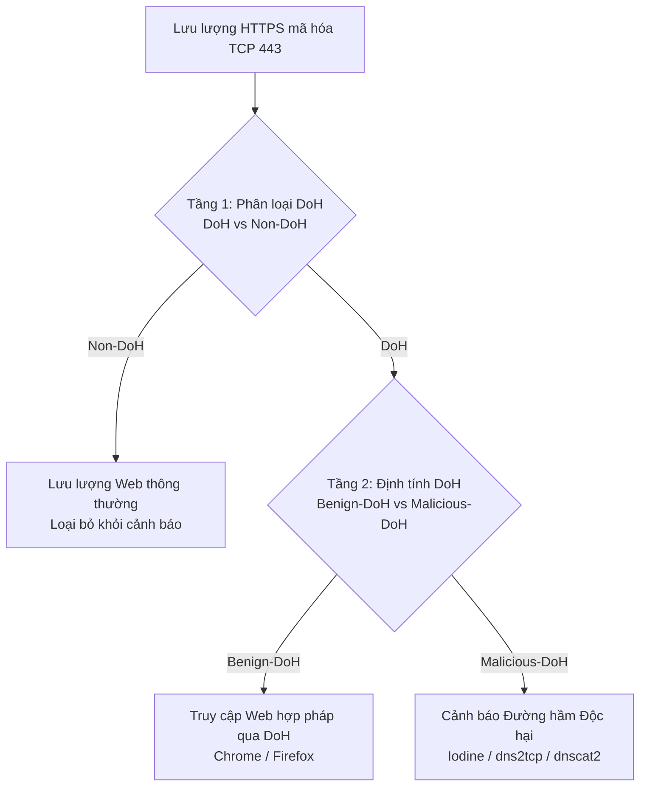

# Phân Tích Chuyên Sâu Bài Báo Khoa Học: "Detection of DoH Tunnels using Time-series Classification of Encrypted Traffic"

---

## 1. Thông Tin Trích Dẫn Thư Mục & Tài Liệu Nguồn

* **Tiêu đề bài báo:** *Detection of DoH Tunnels using Time-series Classification of Encrypted Traffic*
* **Tác giả:** Mohammadreza MontazeriShatoori, Logan Davidson, Gurdip Kaur, Arash Habibi Lashkari
* **Đơn vị công tác:** Canadian Institute for Cybersecurity (CIC), University of New Brunswick (UNB), Fredericton, NB, Canada
* **Hội thảo xuất bản:** 2020 IEEE International Conference on Dependable, Autonomic and Secure Computing, International Conference on Pervasive Intelligence and Computing, International Conference on Cloud and Big Data Computing, International Conference on Cyber Science and Technology Congress (DASC/PiCom/CBDCom/CyberSciTech 2020), Calgary, AB, Canada.
* **Thời gian tổ chức / bản quyền:** 17–22 tháng 8, 2020; ©2020 IEEE.
* **DOI chính thức:** [`10.1109/DASC-PICom-CBDCom-CyberSciTech49142.2020.00026`](https://doi.org/10.1109/DASC-PICom-CBDCom-CyberSciTech49142.2020.00026)
* **Số trang kỷ yếu IEEE:** Trang 63–70 (Đánh số nội bộ bài viết: Trang 1–8).
* **Đường dẫn tệp cục bộ:** `Papers for Capstone Projects/NetworkData2.pdf`
* **Kho mã nguồn & Dữ liệu tham chiếu của nhóm tác giả:**
  * Bộ dữ liệu chính thức *CIRA-CIC-DoHBrw-2020*: [UNB CIC DoHBrw-2020 Dataset Portal](https://www.unb.ca/cic/datasets/dohbrw-2020.html) [Trích dẫn bài báo: Trang 5, Mục IV, Ref 27].
  * Kho mã nguồn công cụ trích xuất và phân tích *DoHlyzer*: [GitHub ahlashkari/DoHLyzer](https://github.com/ahlashkari/DoHLyzer) [Trích dẫn bài báo: Trang 5, Mục III-C-2, Ref 26].
  * Mô-đun trích xuất 28 đặc trưng thống kê *DoHMeter*: [GitHub ahlashkari/DoHLyzer DoHMeter](https://github.com/ahlashkari/DoHLyzer/tree/master/DoHMeter) [Trích dẫn bài báo: Trang 4, Mục III-B-3, Ref 23].
* **Tài trợ đề tài:** Được tài trợ bởi Chương trình Đầu tư Cộng đồng của Cơ quan Đăng ký Internet Canada (CIRA - Canadian Internet Registration Authority) [Trang 8, Lời cảm ơn].

---

## 2. Mô Hình Mối Đe Dọa (Threat Model) & Không Gian Bài Toán

### 2.1 Bối Cảnh DNS Truyền Thống & Sự Chuyển Dịch Sang DoH (RFC 8484)
* `Paper báo cáo` [Trang 1, Mục I]: Giao thức DNS truyền thống (RFC 1034) vận hành dưới dạng bản rõ (cleartext) qua cổng UDP/TCP 53. Kẻ tấn công thường xuyên lợi dụng bản rõ này để thiết lập các kênh ngầm (DNS tunneling), đóng gói mã độc điều khiển (C2 - Command and Control) hoặc đánh cắp dữ liệu (data exfiltration) thông qua các bản ghi TXT, sub-domain động hoặc truy vấn lặp.
* `Paper báo cáo` [Trang 1, Mục I; Trang 2, Hình 2]: DNS over HTTPS (DoH, chuẩn hóa tại RFC 8484) đóng gói các gói tin DNS vào kết nối HTTPS được mã hóa qua TLS trên cổng TCP tiêu chuẩn 443. Mục đích chính là bảo vệ quyền riêng tư người dùng, ngăn chặn nghe lén (eavesdropping) và tấn công thao túng gói tin (MitM) từ nhà cung cấp dịch vụ mạng (ISP).
* `Paper báo cáo` [Trang 1–2, Mục I]: Sự dịch chuyển sang DoH vô hiệu hóa hoàn toàn các hệ thống phát hiện xâm nhập mạng (NIDS/IPS) và tường lửa vành đai truyền thống vì ba nguyên nhân then chốt:
  1. **Tính bất khả tri của tải trọng (Payload Invisibility):** Toàn bộ truy vấn và phản hồi DNS đều bị mã hóa trong phiên TLS (Application Data, Content Type 23), khiến kỹ thuật DPI (Deep Packet Inspection) dựa trên chữ ký, entropy chuỗi tên miền hay kiểm tra trường bản ghi hoàn toàn mất tác dụng.
  2. **Ghép kênh kết nối (Connection Multiplexing qua HTTP/2):** Chuẩn RFC 8484 yêu cầu tối thiểu giao thức HTTP/2 (RFC 7540). Nhiều truy vấn/phản hồi DNS được ghép kênh đồng thời bên trong một phiên TCP/TLS duy nhất, làm nhòe ranh giới đếm gói tin và tần suất phân giải.
  3. **Ẩn danh điểm cuối phía máy chủ (Indistinguishable Anycast Resolvers):** Lưu lượng DoH được chuyển tiếp tới các máy chủ phân giải đệ quy công cộng uy tín (Cloudflare `1.1.1.1`, Google DNS `8.8.8.8`, Quad9 `9.9.9.9`, AdGuard), khiến kỹ thuật tường lửa chặn IP máy chủ độc hại (IP blacklisting) bị vô hiệu hóa.

### 2.2 Mục Tiêu và Cơ Chế Hoạt Động của Kẻ Tấn Công (Adversary Profile)
* `Paper báo cáo` [Trang 3, Mục III-A; Trang 5, Mục IV; Hình 5]: Kẻ tấn công chiếm quyền kiểm soát máy trạm doanh nghiệp, kích hoạt client đường hầm DNS (Iodine, dns2tcp, dnscat2) và trỏ lưu lượng qua một DoH proxy cục bộ.
* `Paper báo cáo` [Trang 5–6, Mục IV]: DoH proxy đóng gói truy vấn DNS vào các truy vấn HTTPS chuẩn hướng tới 4 máy chủ DoH công cộng hợp pháp. Máy chủ DoH công cộng sau đó giải mã đệ quy và truy vấn đến máy chủ tên miền có thẩm quyền (Authoritative Nameserver) do kẻ tấn công trực tiếp kiểm soát bên ngoài Internet.
* `Paper báo cáo` [Trang 6, Mục IV]: Kẻ tấn công tạo lưu lượng truyền dữ liệu với tốc độ phân bố đều ngẫu nhiên từ 100 B/s đến 1100 B/s, kèm theo thời gian trễ giữa các truy vấn nhằm mô phỏng hành vi duyệt web hoặc ẩn mình dưới ngưỡng phát hiện dựa trên lưu lượng băng thông.

### 2.3 Phạm Vi & Vị Trí Giám Sát của Bên Phòng Thủ (Defender Vantage Point)
* `Paper báo cáo` [Trang 3, Mục III; Trang 5, Hình 5]: Vị trí thu thập thụ động (passive network monitor tap) đặt tại cổng ra của mạng nội bộ doanh nghiệp, nằm giữa máy trạm (hoặc DoH proxy) và máy chủ DoH công cộng trên Internet.
* `Nhóm quyết định`: Hệ thống giám sát vận hành hoàn toàn thụ động (passive monitoring) dựa trên siêu dữ liệu lưu lượng (flow metadata) và chuỗi thời gian gói tin (packet time-series), tuyệt đối không yêu cầu chứng chỉ giải mã TLS (Man-in-the-Middle TLS termination) và không can thiệp luồng dữ liệu trên đường truyền.
* `Rủi ro/giả định`: Giả định rằng lưu lượng DNS tunnel đi qua cổng HTTPS 443 tới các máy chủ DoH đã biết hoặc phát hiện được trong mạng; nếu đối phương sử dụng máy chủ DoH riêng biệt không nằm trong dải IP công cộng thì cần tầng phân loại L1 chính xác để bóc tách.

---

## 3. Cấu Trúc Nhãn Hai Tầng (Two-Layer Hierarchical Architecture)

`Paper báo cáo` [Trang 3, Mục III-A; Hình 3]: Bài báo đề xuất mô hình phân cấp nối tiếp hai tầng (two-layered serial architecture) nhằm bóc tách và định danh chính xác đường hầm độc hại:



### Chi Tiết Nhãn Định Danh Từng Tầng:
1. **Tầng 1 (Layer 1 - DoH Traffic Classification):**
   * **Nhiệm vụ:** Phân biệt giữa lưu lượng DoH mã hóa và lưu lượng Web HTTPS thông thường không phải DoH (`DoH` vs `Non-DoH`).
   * **Nhãn `Non-DoH`:** Toàn bộ lưu lượng duyệt web HTTPS thông thường đến các máy chủ web ngoài danh sách máy chủ DoH.
   * **Nhãn `DoH`:** Các luồng HTTPS kết nối trực tiếp đến địa chỉ IP và cổng 443 của 4 nhà cung cấp dịch vụ DoH công cộng (AdGuard, Cloudflare, Google DNS, Quad9) [Trang 3, Mục III-A].
2. **Tầng 2 (Layer 2 - Malicious DoH Characterization):**
   * **Nhiệm vụ:** Sau khi Tầng 1 đã bóc tách chính xác lưu lượng DoH, Tầng 2 phân định luồng DoH đó là hoạt động duyệt web thông thường hay đường hầm độc hại (`Benign-DoH` vs `Malicious-DoH`).
   * **Nhãn `Benign-DoH`:** Lưu lượng DoH phát sinh tự nhiên từ các phiên duyệt web tương tác và tự động qua trình duyệt Mozilla Firefox và Google Chrome [Trang 3, Mục III-A].
   * **Nhãn `Malicious-DoH` (Tunnel-like):** Lưu lượng phát sinh từ các công cụ đường hầm DNS chuyên dụng (`Iodine`, `dns2tcp`, `dnscat2`) nhằm tạo kênh truyền dữ liệu ngầm vượt tường lửa [Trang 3, Mục III-A; Trang 5, Mục IV].

---

## 4. Cấu Trúc Topo Thu Thập Dữ Liệu & Bộ Dữ Liệu CIRA-CIC-DoHBrw-2020

### 4.1 Cấu Trúc Mạng Thu Thập Dữ Liệu Thực Nghiệm
* `Paper báo cáo` [Trang 5, Mục IV; Hình 5]: Môi trường thử nghiệm gồm hai thành phần độc lập:
  * **Sinh lưu lượng thông thường (Benign Traffic Generation):**
    * Trình duyệt sử dụng: Mozilla Firefox và Google Chrome [Trang 5, Mục IV].
    * Cơ chế tự động hóa: Thư viện kiểm thử Selenium điều khiển Firefox (GeckoDriver) và Chrome (ChromeDriver) ở chế độ headless.
    * Tập tên miền mục tiêu: Thu thập từ danh sách 10.000 trang web hàng đầu của Alexa (`https://www.alexa.com/`) [Trang 5, Mục IV, Ref 20]. Tác giả nhấn mạnh việc render trang web qua trình duyệt thật giúp tái tạo đầy đủ các hành vi phân giải phụ (subresource loading, lazy-loading, phân giải tên miền bên thứ ba), điều mà các công cụ tổng hợp đơn giản như `curl` không thể phản ánh.
    * Cấu hình DoH: Trình duyệt được cấu hình định tuyến toàn bộ phân giải DNS qua giao thức DoH tới 4 nhà cung cấp: Cloudflare, Google DNS, Quad9, AdGuard [Trang 5, Mục IV].
  * **Sinh lưu lượng đường hầm độc hại (Malicious Tunnel Generation):**
    * Cơ sở hạ tầng mạng độc lập cách ly [Trang 5, Mục IV].
    * Hệ thống tên miền tuỳ chỉnh với Authoritative Nameserver đóng vai trò máy chủ điều khiển C2 của kẻ tấn công [Trang 5, Mục IV].
    * Cụm máy trạm: 10 máy trạm ảo hóa (client servers) chạy đồng thời, cùng kết nối tới máy chủ C2 duy nhất [Trang 6, Mục IV].
    * Bộ điều phối trung tâm: Một máy chủ độc lập chạy script điều phối Python (`DoH Data Collector`) đọc tệp kịch bản định dạng JSON, truyền lệnh qua SSH tới các client và máy chủ C2 [Trang 5–6, Mục IV].
    * Công cụ đường hầm: Tích hợp 3 tiện ích mã nguồn mở phổ biến: `dns2tcp`, `dnscat2`, `iodine`. Lưu lượng DNS thô được bọc qua DoH proxy cục bộ để đóng gói thành HTTPS gửi tới 4 máy chủ DoH mục tiêu [Trang 5, Mục IV].
    * Tải trọng truyền ngầm: Luồng dữ liệu TCP trực tiếp với tốc độ ngẫu nhiên đều từ 100 B/s đến 1100 B/s [Trang 6, Mục IV].
    * Thu thập gói tin: Sử dụng `tcpdump` bắt gói tin toàn diện trên giao diện mạng nằm giữa DoH proxy và máy chủ DoH trên Internet [Trang 6, Mục IV].

### 4.2 Thống Kê Chi Tiết Bộ Dữ Liệu CIRA-CIC-DoHBrw-2020
`Paper báo cáo` [Trang 6, Bảng II]: Tổng hợp số lượng gói tin (Packets) và số lượng luồng (Flows) thu thập được:

| Nhóm Hành Vi | Công Cụ / Trình Duyệt | Máy Chủ DoH Mục Tiêu | Số Gói Tin (Packets) | Số Luồng (Flows) | Nhãn Gán Trong Tầng |
|---|---|---|---|---|---|
| **Browsing** | Google Chrome | AdGuard | 5.609.000 (5.609K) | 105.141 | Non-DoH & Benign-DoH |
| **Browsing** | Google Chrome | Cloudflare | 6.117.000 (6.117K) | 132.552 | Non-DoH & Benign-DoH |
| **Browsing** | Google Chrome | Google DNS | 5.878.000 (5.878K) | 108.680 | Non-DoH & Benign-DoH |
| **Browsing** | Google Chrome | Quad9 | 10.737.000 (10.737K) | 199.090 | Non-DoH & Benign-DoH |
| **Browsing** | Mozilla Firefox | AdGuard | 4.943.000 (4.943K) | 50.485 | Non-DoH & Benign-DoH |
| **Browsing** | Mozilla Firefox | Cloudflare | 4.299.000 (4.299K) | 90.260 | Non-DoH & Benign-DoH |
| **Browsing** | Mozilla Firefox | Google DNS | 6.413.000 (6.413K) | 138.422 | Non-DoH & Benign-DoH |
| **Browsing** | Mozilla Firefox | Quad9 | 4.956.000 (4.956K) | 92.670 | Non-DoH & Benign-DoH |
| **Tunneling** | dns2tcp | AdGuard | 1.281.000 (1.281K) | 5.459 | Malicious-DoH |
| **Tunneling** | dns2tcp | Cloudflare | 3.694.000 (3.694K) | 6.045 | Malicious-DoH |
| **Tunneling** | dns2tcp | Google DNS | 28.711.000 (28.711K) | 17.423 | Malicious-DoH |
| **Tunneling** | dns2tcp | Quad9 | 8.750.000 (8.750K) | 138.588 | Malicious-DoH |
| **Tunneling** | DNSCat2 | AdGuard | 1.301.000 (1.301K) | 5.369 | Malicious-DoH |
| **Tunneling** | DNSCat2 | Cloudflare | 12.346.000 (12.346K) | 9.230 | Malicious-DoH |
| **Tunneling** | DNSCat2 | Google DNS | 48.069.000 (48.069K) | 11.915 | Malicious-DoH |
| **Tunneling** | DNSCat2 | Quad9 | 19.309.000 (19.309K) | 9.108 | Malicious-DoH |
| **Tunneling** | Iodine | AdGuard | 3.938.000 (3.938K) | 11.336 | Malicious-DoH |
| **Tunneling** | Iodine | Cloudflare | 5.932.000 (5.932K) | 14.110 | Malicious-DoH |
| **Tunneling** | Iodine | Google DNS | 73.459.000 (73.459K) | 12.192 | Malicious-DoH |
| **Tunneling** | Iodine | Quad9 | 22.668.000 (22.668K) | 8.975 | Malicious-DoH |

*Tổng lượng dữ liệu thực tế:* Hơn 1,1 triệu luồng mạng và hơn 278 triệu gói tin được ghi nhận [Trang 6, Mục IV].

---

## 5. Nhóm 28 Đặc Trưng Thống Kê Luồng (DoHMeter Features)

`Paper báo cáo` [Trang 4–5, Mục III-B-3, Bảng I]: Công cụ DoHMeter tính toán 28 đặc trưng thống kê tổng hợp trên toàn bộ vòng đời của mỗi luồng mạng (được định danh bởi 5-tuple: $\langle \text{IP}_{\text{src}}, \text{IP}_{\text{dst}}, \text{Port}_{\text{src}}, \text{Port}_{\text{dst}}, \text{TCP} \rangle$ với ít nhất một cổng là 443).

### Bảng Tổng Hợp 28 Đặc Trưng Phân Loại Theo 4 Nhóm Bản Chất Kỹ Thuật:

| Nhóm Đặc Trưng | Ký Hiệu & Tên Đặc Trưng | Công Thức / Định Nghĩa Kỹ Thuật | Ý Nghĩa Trong Phát Hiện DoH & Tunnel |
|---|---|---|---|
| **Nhóm 1: Dung lượng & Tốc độ Byte** (F1 – F4) | **F1: Flow Bytes Sent**<br>**F2: Flow Sent Rate**<br>**F3: Flow Bytes Received**<br>**F4: Flow Received Rate** | $B_{\text{sent}} = \sum \text{Bytes}_{\text{fwd}}$<br>$R_{\text{sent}} = B_{\text{sent}} / \Delta t_{\text{flow}}$<br>$B_{\text{recv}} = \sum \text{Bytes}_{\text{bwd}}$<br>$R_{\text{recv}} = B_{\text{recv}} / \Delta t_{\text{flow}}$ | Phản ánh bất đối xứng băng thông giữa luồng web (tải về lớn hơn nhiều gửi đi) so với kênh ngầm C2/exfiltration (tải dữ liệu lên đều đặn). |
| **Nhóm 2: Thống kê Chiều dài Gói tin** (F5 – F12) | **F5: Packet Length Mean**<br>**F6: Packet Length Median**<br>**F7: Packet Length Mode**<br>**F8: Packet Length Variance**<br>**F9: Packet Length Std Dev**<br>**F10: Packet Length CV**<br>**F11: Skew from Median**<br>**F12: Skew from Mode** | $\mu_L = \frac{1}{N}\sum L_i$<br>$\text{Median}(L)$<br>$\text{Mode}(L)$<br>$\sigma^2_L = \frac{1}{N}\sum (L_i - \mu_L)^2$<br>$\sigma_L = \sqrt{\sigma^2_L}$<br>$CV_L = \sigma_L / \mu_L$<br>$\text{Skew}_{\text{med}} = \frac{3(\mu_L - \text{Med}_L)}{\sigma_L}$<br>$\text{Skew}_{\text{mode}} = \frac{\mu_L - \text{Mode}_L}{\sigma_L}$ | Phân bố kích thước gói tin phân giải DNS thường tập trung hẹp quanh kích thước bản ghi DNS mã hóa, trong khi web HTTPS thông thường có độ biến thiên chiều dài gói rất lớn (HTML, ảnh, video chunks). |
| **Nhóm 3: Thống kê Khoảng thời gian Đến (Inter-Arrival Time)** (F13 – F20) | **F13: Packet Time Mean**<br>**F14: Packet Time Median**<br>**F15: Packet Time Mode**<br>**F16: Packet Time Variance**<br>**F17: Packet Time Std Dev**<br>**F18: Packet Time CV**<br>**F19: Skew from Median**<br>**F20: Skew from Mode** | $\Delta t_i = t_i - t_{i-1}$<br>$\mu_T = \frac{1}{N-1}\sum \Delta t_i$<br>$\text{Median}(T)$<br>$\text{Mode}(T)$<br>$\sigma^2_T = \frac{1}{N-1}\sum (\Delta t_i - \mu_T)^2$<br>$\sigma_T = \sqrt{\sigma^2_T}$<br>$CV_T = \sigma_T / \mu_T$<br>$\text{Skew}_{\text{med}} = \frac{3(\mu_T - \text{Med}_T)}{\sigma_T}$<br>$\text{Skew}_{\text{mode}} = \frac{\mu_T - \text{Mode}_T}{\sigma_T}$ | Kênh ngầm do máy móc tạo ra (automated tunnels) thường có nhịp gửi tuần hoàn hoặc phân bố ngẫu nhiên đồng đều (uniform random rate), khác với nhịp thao tác chuột/bàn phím ngắt quãng của con người duyệt web. |
| **Nhóm 4: Thống kê Chênh lệch Thời gian Request/Response** (F21 – F28) | **F21: Req/Resp Diff Mean**<br>**F22: Req/Resp Diff Median**<br>**F23: Req/Resp Diff Mode**<br>**F24: Req/Resp Diff Variance**<br>**F25: Req/Resp Diff Std Dev**<br>**F26: Req/Resp Diff CV**<br>**F27: Skew from Median**<br>**F28: Skew from Mode** | Tính chênh lệch thời gian giữa nhóm gói yêu cầu gửi đi và nhóm gói phản hồi trả về liền kề:<br>$\mu_{\Delta RR} = \frac{1}{K}\sum \Delta t_{\text{resp} - \text{req}}$<br>$\text{Median}(\Delta RR)$<br>$\text{Mode}(\Delta RR)$<br>$\sigma^2_{\Delta RR}, \sigma_{\Delta RR}, CV_{\Delta RR}$<br>$\text{Skew}_{\text{med}}, \text{Skew}_{\text{mode}}$ | Thời gian xử lý truy vấn DNS đệ quy thông thường rất ngắn (vài ms đến vài chục ms), trong khi đường hầm DNS qua Authoritative C2 server chịu thêm độ trễ truyền dữ liệu ngầm và phản hồi TCP qua proxy. |

### Giao Thức Làm Sạch Dữ Liệu Ban Đầu:
* `Paper báo cáo` [Trang 6, Mục IV]: Các luồng có số lượng gói tin quá ít không đủ để tính toán phương sai, độ lệch chuẩn và độ xiên (skewness) sẽ sinh ra giá trị `NaN`.
* `Paper báo cáo` [Trang 6, Mục IV]: Trong toàn bộ tập dữ liệu hơn 1,1 triệu luồng, chỉ có **$n < 50$ luồng** xuất hiện giá trị `NaN` và các luồng này bị loại bỏ hoàn toàn trong bước tiền xử lý.

---

## 6. Mô Hình Chuỗi Thời Gian: Kỹ Thuật Gom Cụm Gói Tin (Packet Clumping)

### 6.1 Cơ Chế Kỹ Thuật & Lý Do Đề Xuất
* `Paper báo cáo` [Trang 4, Mục III-B-1; Hình 4]: Điểm nghẽn nghiêm trọng nhất của việc dùng 28 đặc trưng thống kê là **độ trễ thu thập**: hệ thống phải chờ toàn bộ luồng kết thúc (trung bình 20,4 giây đối với Tầng 1 và 53,9 giây đối với Tầng 2) mới trích xuất được đặc trưng để phân loại. Điều này khiến việc ngăn chặn theo thời gian thực (inline active blocking) trở nên bất khả thi.
* `Paper báo cáo` [Trang 4, Mục III-B-1]: Kỹ thuật **Packet Clumping** nhóm các gói tin kế tiếp nhau cùng chiều thành một cụm (burst) trừ khi luồng đổi chiều hoặc thời gian ngắt quãng vượt quá ngưỡng timeout. Kỹ thuật này giải quyết vấn đề phân mảnh dữ liệu của TCP/TLS mà không cần giải mã tải trọng.
* `Paper báo cáo` [Trang 4, Mục III-B-1]: Loại bỏ hoàn toàn các gói tin thuần điều khiển TCP không mang tải trọng (pure TCP ACK, SYN, FIN, RST) và các gói tin kích thước quá nhỏ.

### 6.2 Cấu Trúc 5-Tuple Của Mỗi Cụm (Packet Clump)
`Paper báo cáo` [Trang 4, Mục III-B-1]: Mỗi cụm $C$ được mã hóa duy nhất bởi bộ 5 tham số:
$$C = \langle \text{size}, \text{pktCount}, \text{direction}, \text{duration}, \text{interarrival} \rangle$$
Trong đó:
1. $\text{size}$: Tổng số byte tải trọng TLS Application Data trong cụm.
2. $\text{pktCount}$: Tổng số gói tin vật lý được gom vào cụm.
3. $\text{direction}$: Chiều truyền dữ liệu tương đối so với bên khởi tạo luồng ($0$ cho chiều Client $\to$ Server, $1$ cho chiều Server $\to$ Client; hoặc $+1$ và $-1$ trong mã nguồn tham chiếu).
4. $\text{duration}$: Khoảng thời gian từ gói tin đầu tiên đến gói tin cuối cùng trong cụm ($t_{\text{last}} - t_{\text{first}}$).
5. $\text{interarrival}$: Khoảng thời gian từ lúc kết thúc cụm trước đó đến khi bắt đầu cụm hiện tại.

*Lưu ý từ mã nguồn tham chiếu DoHLyzer:* Trong tệp `meter/time_series/flow_clumps.py` và `analyzer/dataset.py`, thứ tự được lưu là:
$$C_{\text{DoHLyzer}} = \langle \text{interarrival}, \text{duration}, \text{size}, \text{pktCount}, \text{direction} \rangle$$
Đây là sự hoán vị thứ tự biểu diễn nhưng giữ nguyên vẹn 5 giá trị đặc trưng cốt lõi.

### 6.3 Phân Đoạn Cửa Sổ Trượt (Sliding Window Segmentation)
* `Paper báo cáo` [Trang 4, Mục III-B-1]: Luồng mạng được chuyển hóa thành chuỗi các cụm $S = (C_1, C_2, \dots, C_n)$.
* `Paper báo cáo` [Trang 4, Mục III-B-1]: Cửa sổ trượt có kích thước $\ell$ được áp dụng để trích xuất các phân đoạn cố định:
  $$F = \{ (C_i, C_{i+1}, \dots, C_{i+\ell-1}) \mid 1 \le i \le |S| - \ell + 1 \}$$
* `Paper báo cáo` [Trang 4, Mục III-B-1]: Đối với các luồng ngắn có số lượng cụm ít hơn kích thước cửa sổ ($|S| < \ell$), chuỗi được đệm thêm các cụm rỗng (zero-padded with empty clumps).

---

## 7. Giao Thức Phân Chia Dữ Liệu Của Bài Báo (80/20 Flow-Level Protocol)

* `Paper báo cáo` [Trang 6, Mục IV]: Tác giả sử dụng giao thức phân chia giữ lại (Holdout Split):
  * **Tỷ lệ:** 80% tập huấn luyện (Training Set), 20% tập kiểm thử (Testing Set).
  * **Cấp độ phân chia:** Phân chia hoàn toàn ngẫu nhiên ở **cấp độ luồng (Flow Level)** trên toàn bộ dữ liệu hợp lệ sau khi loại bỏ <50 luồng NaN.
  * **Tính đồng nhất:** Tập dữ liệu phân chia 80/20 được giữ cố định giống hệt nhau khi đánh giá các mô hình thống kê truyền thống lẫn mô hình chuỗi thời gian LSTM.
* `Rủi ro/giả định`: Phân chia ngẫu nhiên ở cấp độ luồng (Flow-level random split) tiềm ẩn nguy cơ rò rỉ dữ liệu cực kỳ cao (Data Leakage / Session Leakage). Các luồng xuất phát từ cùng một phiên duyệt web của client hoặc cùng một lượt chạy công cụ tunneling trong cùng một khoảng thời gian sẽ bị phân tán vào cả tập Train và Test, khiến mô hình học thuộc đặc trưng phiên (fingerprint) thay vì khái quát hóa bản chất giao thức.

---

## 8. Kết Quả Thực Nghiệm Công Bố (Tables III – VI)

### 8.1 Bảng III: Phân Loại DoH Tầng 1 Sử Dụng 28 Đặc Trưng Thống Kê [Trang 6]
* Độ trễ thu thập luồng trung bình: **Mean Delay = 20,393 giây**, **Median Delay = 1,397 giây**

| Mô Hình Bộ Phân Loại | Precision | Recall | F-Score | Median Latency (s) | Ghi Chú Đánh Giá |
|---|---|---|---|---|---|
| **Random Forest (RF)** | **0,993** | **0,993** | **0,993** | 1,397 | Đạt hiệu năng phân loại cao nhất |
| **C4.5 Decision Tree** | **0,993** | **0,993** | **0,993** | 1,397 | Hiệu năng tương đương Random Forest |
| **2D CNN** | 0,980 | 0,980 | 0,980 | 1,397 | Tái định hình 28 đặc trưng thành ma trận 2D |
| **DNN** | 0,970 | 0,970 | 0,970 | 1,397 | Mạng truyền thẳng nhiều tầng |
| **SVM** | 0,877 | 0,877 | 0,877 | 1,397 | Phân loại lề cực đại |
| **Naive Bayes (NB)** | 0,840 | 0,834 | 0,833 | 1,397 | Giả định độc lập có điều kiện |

### 8.2 Bảng IV: Định Tính DoH Tầng 2 (Benign vs Malicious) Sử Dụng 28 Đặc Trưng Thống Kê [Trang 6]
* Độ trễ thu thập luồng trung bình: **Mean Delay = 53,924 giây**, **Median Delay = 34,064 giây**

| Mô Hình Bộ Phân Loại | Precision | Recall | F-Score | Median Latency (s) | Ghi Chú Đánh Giá |
|---|---|---|---|---|---|
| **Random Forest (RF)** | **0,999** | **0,999** | **0,999** | 34,064 | Hiệu năng phân định gần như tuyệt đối |
| **C4.5 Decision Tree** | **0,999** | **0,999** | **0,999** | 34,064 | Hiệu năng tương đương Random Forest |
| **2D CNN** | 0,990 | 0,990 | 0,990 | 34,064 | |
| **DNN** | 0,980 | 0,980 | 0,980 | 34,064 | |
| **SVM** | 0,890 | 0,885 | 0,884 | 34,064 | |
| **Naive Bayes (NB)** | 0,836 | 0,833 | 0,832 | 34,064 | |

### 8.3 Bảng V: Hiệu Năng Mô Hình LSTM Tầng 1 (DoH vs Non-DoH) Theo Độ Dài Cụm $\ell$ [Trang 7]
* `Paper báo cáo` [Trang 7, Mục V-B]: Khảo sát toàn diện với $\ell \in [1, 10]$:

| Độ Dài Cụm ($\ell$) | Precision | Recall | F1-Score | Mean Duration (s) | Median Duration (s) | Đánh Giá Ngưỡng Quyết Định |
|:---:|:---:|:---:|:---:|:---:|:---:|---|
| **1** | 0,877 | 0,876 | 0,876 | 0,081 | 0,000 | 1 cụm chưa đủ phân biệt |
| **2** | 0,950 | 0,949 | 0,949 | 0,167 | 0,002 | Bước nhảy vọt hiệu năng |
| **3** | 0,953 | 0,951 | 0,951 | 0,262 | 0,010 | |
| **4** | 0,983 | 0,983 | 0,983 | 0,366 | 0,020 | |
| **5** | 0,987 | 0,987 | 0,987 | 0,468 | 0,030 | |
| **6 (Ngưỡng Tối Ưu)** | **0,993** | **0,993** | **0,993** | **0,574** | **0,047** | **Đạt ngang RF (0,993), độ trễ giảm từ 20,4s còn 0,574s (<0,8s)** |
| **7** | 0,996 | 0,996 | 0,996 | 0,675 | 0,060 | |
| **8** | 0,996 | 0,996 | 0,996 | 0,775 | 0,077 | |
| **9** | 0,998 | 0,998 | 0,998 | 0,871 | 0,091 | |
| **10** | **0,998** | **0,998** | **0,998** | 0,964 | 0,105 | Bão hòa độ chính xác |

*Phát hiện cốt lõi Tầng 1 [Trang 7, Mục V-B]:* Tại $\ell = 6$, LSTM đạt Precision $0,993$ ngang ngửa Random Forest tốt nhất của mô hình 28 đặc trưng nhưng cắt giảm thời gian phát hiện từ **20,393 giây xuống 0,574 giây** (thời gian trung vị chỉ 0,047 giây và 100% mẫu dưới 0,8 giây).

### 8.4 Bảng VI: Hiệu Năng Mô Hình LSTM Tầng 2 (Benign DoH vs Malicious DoH) Theo Độ Dài Cụm $\ell$ [Trang 7]
* `Paper báo cáo` [Trang 7, Mục V-B]: Khảo sát toàn diện với $\ell \in [1, 10]$:

| Độ Dài Cụm ($\ell$) | Precision | Recall | F1-Score | Mean Duration (s) | Median Duration (s) | Đánh Giá Ngưỡng Quyết Định |
|:---:|:---:|:---:|:---:|:---:|:---:|---|
| **1** | 0,825 | 0,792 | 0,782 | 0,164 | 0,002 | Nhận diện kém |
| **2** | 0,985 | 0,984 | 0,985 | 0,329 | 0,022 | Cải thiện mạnh mẽ |
| **3 (Ngưỡng Tối Ưu)** | **0,991** | **0,991** | **0,991** | **0,502** | **0,050** | **Đạt ngang RF (0,991), độ trễ giảm từ 53,9s còn 0,502s (<1,0s)** |
| **4** | 0,995 | 0,995 | 0,995 | 0,685 | 0,094 | |
| **5** | 0,997 | 0,997 | 0,997 | 0,872 | 0,142 | |
| **6** | 0,998 | 0,998 | 0,998 | 1,063 | 0,203 | F1 đạt 0,998 |
| **7** | 0,997 | 0,997 | 0,997 | 1,260 | 0,258 | |
| **8** | 0,999 | 0,999 | 0,999 | 1,450 | 0,313 | |
| **9** | 0,999 | 0,999 | 0,999 | 1,630 | 0,373 | |
| **10** | **0,999** | **0,999** | **0,999** | 1,803 | 0,440 | F1 đạt 0,999 |

*Phát hiện cốt lõi Tầng 2 [Trang 7, Mục V-B]:* Tại $\ell = 3$, LSTM đã đạt Precision $0,991$ tương đương các mô hình thống kê tĩnh, nhưng cắt giảm thời gian phát hiện từ **53,924 giây xuống 0,502 giây** (thời gian trung vị 0,050 giây và 100% mẫu dưới 1,0 giây). Nếu tăng lên $\ell = 6$, Precision đạt $0,998$ với độ trễ 1,063 giây.

---

## 9. Lỗi Đánh Máy, Sai Sót Thuật Toán & Các Điểm Mơ Hồ Trong Tài Liệu Gốc

Trong quá trình phân tích đối chiếu kỹ lưỡng tệp PDF gốc `Papers for Capstone Projects/NetworkData2.pdf`, nhóm nghiên cứu đã phát hiện một loạt lỗi in ấn, lỗi logic thuật toán và các điểm thiếu hụt kỹ thuật nghiêm trọng cần được khắc phục tường minh:

### 9.1 Lỗi Đảo Ngược Logic Trong Thuật Toán 1 (Algorithm 1 Logic Inversion)
* `Paper báo cáo` [Trang 4, Algorithm 1]:
  ```text
  Algorithm 1: Clumping Process
  ...
  Line 10: until currentClump.direction = packets[counter].direction or timePassed > timeout
  ...
  ```
* `Rủi ro/giả định`: Định nghĩa cốt lõi của một cụm gói tin (clump) là một chuỗi các gói tin **cùng chiều** liên tiếp nhau. Vì vậy, vòng lặp gom gói tin phải tiếp tục khi các gói tin cùng chiều, và **chỉ được kết thúc** khi gói tin tiếp theo **khác chiều** (`!=`) hoặc khoảng cách thời gian vượt quá ngưỡng timeout. Việc viết dấu bằng `=` ở điều kiện dừng là lỗi in ấn logic tai hại (hoặc lỗi phông ký tự từ $\neq$ biến thành $=$). Nếu thực thi đúng như văn bản in, cụm sẽ bị ngắt ngay lập tức khi xuất hiện gói tin cùng chiều.
* `Nhóm quyết định`: Trong giao thức tái hiện, điều kiện dừng bắt buộc phải được cài đặt thành:
  $$\text{Dừng khi: } \text{currentClump.direction} \neq \text{packets}[\text{counter}].\text{direction} \quad \text{HOẶC} \quad \text{timePassed} > \text{timeout}$$

### 9.2 Lỗi Vượt Biên Mảng Trong Thuật Toán 1 (Off-by-One Array Bounds Error)
* `Paper báo cáo` [Trang 4, Algorithm 1]: Dòng 7 thêm gói tin `packets[counter]`, dòng 8 tăng `counter <- counter + 1`, dòng 9 truy cập `packets[counter].time`.
* `Rủi ro/giả định`: Khi `counter` đạt tới gói tin cuối cùng của luồng ($N-1$), dòng 8 tăng `counter` lên $N$. Lúc này dòng 9 và 10 truy cập phần tử `packets[N]` sẽ lập tức kích hoạt lỗi chỉ số mảng vượt biên (IndexOutOfBoundsException / IndexError).
* `Nhóm quyết định`: Cần kiểm tra cận mảng chặt chẽ: `if counter >= len(packets): break` trước khi tính toán `timePassed`.

### 9.3 Lỗi Rụng Phông Ký Tự Ký Hiệu Cửa Sổ Trượt $\ell$ Trong Văn Bản
* `Paper báo cáo` [Trang 4, Cột 1]: Xuất hiện các khoảng trống mất ký tự trắng:
  * *"We use a sliding window with a size of [KHOẢNG TRỐNG] over this sequence of clumps..."*
  * *"Using [KHOẢNG TRỐNG] as a hyper-parameter specifying the number of clumps in a segment..."*
  * Công thức tập phân đoạn in thiếu chỉ số: $F = \{ (C_i, \dots, C_{i+}) \mid 1 \le i < |S| - \}$
* `Nhóm quyết định`: Dựa trên tiêu đề Bảng V và Bảng VI, ký tự bị rụng là ký hiệu $\ell$ (hoặc $w$). Công thức toán học chuẩn tắc được khôi phục lại là:
  $$F = \{ (C_i, C_{i+1}, \dots, C_{i+\ell-1}) \mid 1 \le i \le |S| - \ell + 1 \}$$

### 9.4 Lỗi Trình Bày Lệch Cột Trung Vị Bảng III & Bảng IV (Median Column Misalignment)
* `Paper báo cáo` [Trang 6, Bảng III & IV]: Cột `Median` trong bảng chỉ có một giá trị duy nhất nằm trên dòng `C4.5` (`1.397` ở Bảng III và `34.064` ở Bảng IV), các dòng còn lại để trống.
* `Nhóm quyết định`: Đối chiếu với phần diễn giải văn bản tại Mục V-A (*"All the classifiers share a mean delay of 20.393 seconds ... Median: 1.397"*), hai con số $1,397\text{ s}$ và $34,064\text{ s}$ là **thời lượng trung vị của toàn bộ luồng trong tập dữ liệu** (Dataset-wide median flow duration), không phải là chỉ số riêng biệt của thuật toán C4.5.

### 9.5 Hiện Tượng Chèn Văn Bản Vào Giữa Bảng II (Table II Layout Interleaving)
* `Paper báo cáo` [Trang 6, Bảng II]: Đoạn văn mô tả tiền xử lý dữ liệu (*"Working on all of the captured traffic...", "NaN values..."*) bị dàn trang đè trực tiếp vào giữa các dòng dữ liệu của Firefox và dns2tcp.
* `Nhóm quyết định`: Tách biệt hoàn toàn phần bảng dữ liệu (đã khôi phục chuẩn xác tại Mục 4.2 của tài liệu này) và phần tiền xử lý dữ liệu.

---

## 10. Danh Sách Siêu Tham Số Bị Thiếu Cần Cho Quá Trình Tái Hiện (Specification Gaps)

Bài báo PDF lược bỏ hầu hết các tham số cấu hình kỹ thuật cụ thể. Để có thể tái hiện thực nghiệm, nhóm nghiên cứu phân loại và ghi nhận rõ các khoảng trống này:

| STT | Tham Số Kỹ Thuật Bị Thiếu | Tình Trạng Trong Paper | Nguồn Bổ Khuyết / Khuyến Nghị Tái Hiện | Nhãn Phân Loại |
|:---:|---|---|---|:---:|
| **1** | **Ngưỡng Timeout Của Cụm (`timeout`)** | Thuật toán 1 ghi `timePassed > timeout` nhưng không định nghĩa giá trị bằng bao nhiêu. | Tìm thấy trong mã nguồn `DoHLyzer/meter/constants.py`: `CLUMP_TIMEOUT = 0.001` (1 ms). | `Nhóm quyết định` |
| **2** | **Ngưỡng Kích Thước Gói Tin Bị Bỏ Qua** | Ghi "packets too small to carry data frames" bị bỏ qua, không có con số byte cụ thể. | Trong chuẩn TCP/IP, gói pure ACK có kích thước 40–54 bytes. Ngưỡng cắt lọc thực tế là payload length $> 0$ hoặc IP length $> 66$ bytes. | `Nhóm quyết định` |
| **3** | **Biểu Diễn Véc-tơ Đệm Cho Cụm Rỗng** | Ghi "padded with empty clumps" nhưng không nêu giá trị số học. | Trong DoHLyzer `analyzer/dataset.py`, đệm vector `[-1, -1, -1, -1, 0]` hoặc vector số 0 `[0, 0, 0, 0, 0]`. | `Nhóm quyết định` |
| **4** | **Bước Nhảy Cửa Sổ Trượt (Stride)** | Công thức phân đoạn ngụ ý stride = 1, nhưng không nói rõ lúc kiểm thử có dùng stride = $\ell$ không. | Tái hiện mặc định với stride = 1 trong trích xuất chuỗi; kiểm thử bổ sung đánh giá non-overlapping window. | `Nhóm quyết định` |
| **5** | **Kiến Trúc Mạng Nơ-ron Chi Tiết** | Ghi chung chung "4 hidden layers (including an LSTM layer at the second hidden layer)". Không có số nơ-ron, activation, dropout rate. | Trong DoHLyzer `analyzer/models/`: `v1.py` dùng `LSTM(8*l) -> Dense(6*l) -> Dropout(0.2) -> Dense(2*l) -> Dense(1, sigmoid)`. | `Nhóm quyết định` |
| **6** | **Thuật Toán Tối Ưu & Siêu Tham Số Huấn Luyện** | Không công bố Optimizer (Adam/SGD), Learning Rate, Batch Size, Epochs, Loss Function. | Sử dụng Adam optimizer, learning rate $= 10^{-3}$, Binary Crossentropy, Batch Size $= 64$ hoặc $128$, Early Stopping. | `Nhóm quyết định` |
| **7** | **Tái Cấu Trúc Ma Trận Đầu Vào 2D CNN** | Ghi 2D CNN nhận 28 đặc trưng nhưng không nêu cách biến đổi vector 1D thành ma trận 2D. | Tái cấu trúc ma trận $4 \times 7$ hoặc ma trận $6 \times 6$ có zero-padding; bộ lọc Conv2D $2 \times 2$. | `Nhóm quyết định` |
| **8** | **Siêu Tham Số ML Truyền Thống** | Không nêu số cây RF, độ sâu C4.5, kernel SVM, tham số phân tán Naive Bayes. | Sử dụng cấu hình chuẩn scikit-learn: RF (`n_estimators=100`), C4.5 (`criterion='entropy'`), SVM (`kernel='rbf'`). | `Nhóm quyết định` |
| **9** | **Chuẩn Hóa Dữ Liệu (Data Normalization)** | Không nêu rõ áp dụng Z-score chuẩn hóa hay Min-Max scaler trước khi đưa vào SVM/DNN/LSTM. | Phải huấn luyện Scaler (StandardScaler/MinMax) nghiêm ngặt CHỈ trên tập Train, sau đó transform sang tập Test. | `Nhóm quyết định` |
| **10** | **Chống Rò Rỉ Dữ Liệu (Session Leakage Guard)** | Sử dụng 80/20 random split ở cấp độ luồng, gây rò rỉ mẫu giữa Train và Test. | Nhóm đề xuất bổ sung giao thức phân chia Group/Session-based Split bên cạnh giao thức 80/20 gốc. | `Nhóm quyết định` |

---

## 11. Tổng Kết Kết Luận Khoa Học Của Bài Báo

1. `Paper báo cáo` [Trang 7–8, Mục V & VI]: Phân loại lưu lượng mạng dựa trên các đặc trưng thống kê tổng hợp (như 28 đặc trưng của DoHMeter) đạt độ chính xác rất cao ($F_1 \approx 0,993$ ở Tầng 1 và $0,999$ ở Tầng 2 với Random Forest), nhưng có nhược điểm chí mạng là độ trễ quá lớn (20 đến 54 giây), không đáp ứng được yêu cầu phát hiện và ngăn chặn thời gian thực.
2. `Paper báo cáo` [Trang 7–8, Mục V & VI]: Kỹ thuật chuỗi thời gian gom cụm gói tin (Packet Clumping) kết hợp mô hình học sâu tuần hoàn (LSTM) giải quyết trọn vẹn sự đánh đổi (trade-off) giữa độ chính xác và độ trễ:
   * Tại **Tầng 1**, chỉ cần **$\ell = 6$ cụm** gói tin đầu tiên là đạt $F_1 = 0,993$ (tương đương Random Forest), giảm độ trễ phát hiện xuống còn **0,574 giây** ($< 0,8$ giây đối với 100% mẫu).
   * Tại **Tầng 2**, chỉ cần **$\ell = 3$ cụm** gói tin là đạt $F_1 = 0,991$, giảm độ trễ từ 53,9 giây xuống còn **0,502 giây** ($< 1,0$ giây đối với 100% mẫu).
3. `Nhóm quyết định`: Công trình có đóng góp học thuật và thực tiễn xuất sắc, nhưng tài liệu công bố tồn tại nhiều điểm mơ hồ và lỗi in ấn nghiêm trọng. Việc xây dựng một giao thức tái hiện chuẩn tắc đòi hỏi phải phân tách rạch ròi giữa việc "tái hiện nguyên bản lỗi thời" và "hiệu chỉnh hiện đại hóa", đồng thời bảo đảm an toàn tuyệt đối không sinh lưu lượng tấn công thật trong môi trường nghiên cứu.
