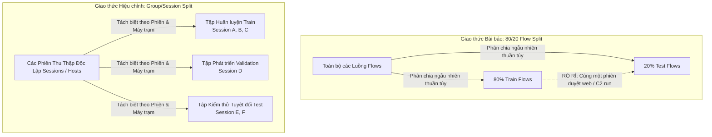
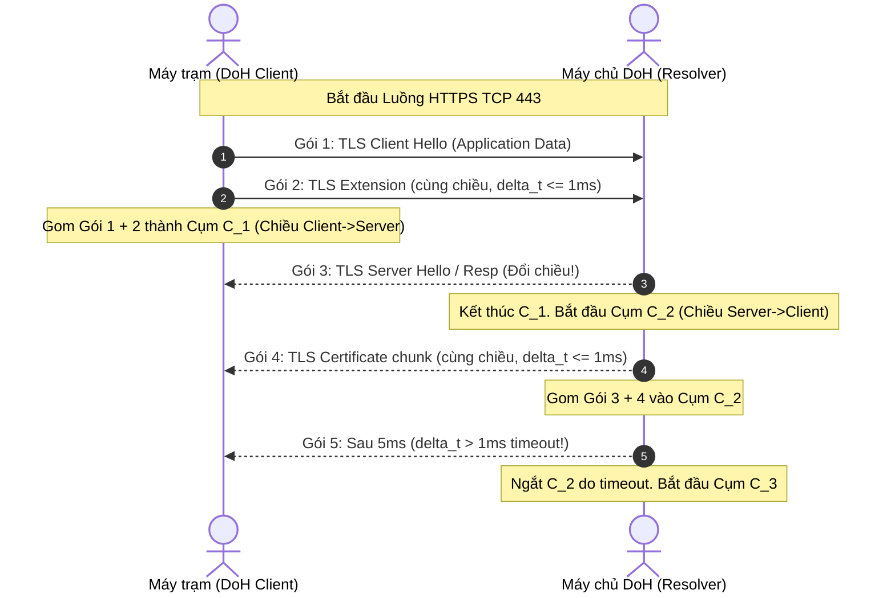

# Giao Thức Tái Hiện Thực Nghiệm (Replication Protocol): Phát Hiện Đường Hầm DoH

---

## 1. Giới Thiệu & Định Hướng Giao Thức

Tài liệu này xác lập quy trình chuẩn tắc nhằm tái hiện thực nghiệm công trình nghiên cứu:
> **MontazeriShatoori et al. (2020), *Detection of DoH Tunnels using Time-series Classification of Encrypted Traffic*, IEEE DASC/PiCom/CBDCom/CyberSciTech 2020.**  
> DOI: [`10.1109/DASC-PICom-CBDCom-CyberSciTech49142.2020.00026`](https://doi.org/10.1109/DASC-PICom-CBDCom-CyberSciTech49142.2020.00026) | Tệp cục bộ: `Papers for Capstone Projects/NetworkData2.pdf`

### 1.1 Nguyên Tắc Phân Tách Giữa Tái Hiện Nguyên Bản và Giao Thức Hiệu Chỉnh
* `Paper báo cáo`: Bài báo sử dụng phân chia ngẫu nhiên 80/20 ở cấp độ luồng (flow level), áp dụng mô hình mạng nơ-ron 4 tầng có lớp ẩn thứ hai là LSTM, trích xuất chuỗi cụm gói tin (packet clumping) và 28 đặc trưng thống kê luồng.
* `Nhóm quyết định`: Nhóm nghiên cứu thiết lập sự phân định rạch ròi thành hai lộ trình độc lập:
  1. **Lộ trình 1: Tái hiện nguyên bản (Exact Replication Path):** Tái tạo trung thực tối đa các điều kiện thực nghiệm của bài báo bằng cách sử dụng bộ dữ liệu gốc *CIRA-CIC-DoHBrw-2020*, giữ nguyên phân chia 80/20 flow-level, sử dụng đúng thông số timeout 1 ms tìm thấy trong mã nguồn tham chiếu DoHLyzer của nhóm tác giả, nhằm kiểm chứng xem các con số trong Bảng III–VI có thể lặp lại hay không.
  2. **Lộ trình 2: Giao thức hiện đại hóa & Hiệu chỉnh (Corrected & Modern Protocol Path):** Khắc phục các điểm yếu phương pháp luận của bài báo gốc: sửa lỗi đảo ngược logic của Thuật toán 1, thay thế phân chia 80/20 flow-level bằng phân chia theo Nhóm/Phiên (Group/Session-based Split) để triệt tiêu rò rỉ dữ liệu, nâng cấp mô hình học sâu lên PyTorch hiện đại, và bổ sung phân tích độ nhạy (ablation study) cùng phân tích lỗi (error analysis).

### 1.2 Ranh Giới An Toàn Phòng Thí Nghiệm & Phạm Vi Demo
* `Nhóm quyết định`: Nghiên cứu này tuân thủ định hướng phòng thủ thụ động (passive defensive monitoring).
* `Nhóm quyết định`: Tuyệt đối không cài đặt, không kích hoạt, và không vận hành các công cụ tạo đường hầm độc hại thật (`iodine`, `dns2tcp`, `dnscat2`) trong môi trường thực thi cục bộ. Tuyệt đối không phát lại gói tin thô (PCAP replay) ra mạng internet hoặc mạng nội bộ trường học.
* `Nhóm quyết định`: Mô-đun demo nội bộ (`src/doh_reproduction/demo.py`) chỉ sử dụng thư viện chuẩn của Python 3 (zero external dependencies) và vận hành một công cụ proxy thử nghiệm quy trình theo nguyên mẫu chuỗi tất định (Deterministic Sequence-Prototype Workflow Proxy). Bộ proxy này phục vụ mục đích kiểm chứng quy trình đường ống (workflow proof) và cấu trúc dữ liệu JSON, **tuyệt đối không được tuyên bố hay giả lập là đã tái hiện được hiệu năng của mô hình LSTM trong bài báo**.

---

## 2. Quy Trình Thu Thập, Nguồn Gốc Dữ Liệu & Kiểm Tra Toàn Vẹn (Data Provenance & Checksum)

### 2.1 Các Điểm Truy Cập Bộ Dữ Liệu CIRA-CIC-DoHBrw-2020
* `Paper báo cáo` [Trang 5, Mục IV, Ref 27]: Bộ dữ liệu được phát hành bởi Viện An ninh mạng Canada (Canadian Institute for Cybersecurity - CIC), Đại học New Brunswick (UNB).
* `Nhóm quyết định`: Các kênh tiếp cận dữ liệu chính thống bao gồm:
  1. **Cổng thông tin UNB CIC chính thức:** [https://www.unb.ca/cic/datasets/dohbrw-2020.html](https://www.unb.ca/cic/datasets/dohbrw-2020.html). Yêu cầu gửi biểu mẫu đăng ký học thuật trực tuyến để nhận liên kết tải về.
  2. **Máy chủ dữ liệu trực tiếp CIC:** [http://cicresearch.ca//CICDataset/DoHBrw-2020/](http://cicresearch.ca//CICDataset/DoHBrw-2020/).
  3. **Biến thể dữ liệu cân bằng BCCC-CIRA-CIC-DoHBrw-2020:** [York University BCCC Portal](https://www.yorku.ca/research/bccc/ucs-technical/cybersecurity-datasets-cds/dns-over-https-bccc-cira-cic-dohbrw-2020/). Bản phát hành năm 2023 của Niktabe et al., sử dụng kỹ thuật SMOTE để tạo thế cân bằng 50/50 giữa duyệt web và tunnel.
  4. **Bản sao trích xuất sẵn (Pre-extracted Kaggle Mirrors):** Bộ đặc trưng dạng bảng CSV được cộng đồng trích xuất tại `dhoogla/cicdohbrw2020` và `supplejade/bccc-cira-cic-dohbrw-2020-dns-over-http`.
  5. **Dữ liệu mẫu chuỗi cụm tích hợp trong DoHLyzer:** Hai tệp nén `doh.json.gz` và `ndoh.json.gz` có sẵn trong thư mục `analyzer/sample_data/` thuộc mã nguồn gốc của nhóm tác giả: [https://github.com/ahlashkari/DoHLyzer/tree/master/analyzer/sample_data](https://github.com/ahlashkari/DoHLyzer/tree/master/analyzer/sample_data).

### 2.2 Quy Trình Xác Minh Mã Băm Toàn Vẹn (Integrity Checksum Steps)
`Nhóm quyết định`: Mọi tệp dữ liệu thô (PCAP) hoặc tệp đặc trưng phái sinh (CSV, JSON) khi được tải về môi trường nghiên cứu đều bắt buộc phải trải qua quy trình xác minh tính toàn vẹn:

1. **Khởi tạo mã băm SHA-256:** Tính toán chuỗi mã băm SHA-256 chuẩn cho từng tệp lưu trữ.
   ```bash
   sha256sum <ten_tep_du_lieu> > checksums.sha256
   ```
2. **Đối chiếu tệp kê khai nguồn:** So khớp mã băm thu được với bảng mã băm được công bố từ cổng CIC hoặc kho lưu trữ nguồn.
3. **Ghi vết vào Manifest:** Lưu trữ giá trị SHA-256, kích thước byte, ngày tải, người thực hiện và liên kết cấp phép vào tệp kê khai `dataset_manifest.json`.

---

## 3. Chiến Lược Phân Chia Dữ Liệu: Flow-Level vs Group/Session-Based Split



### 3.1 Phân Tích Rủi Ro Rò Rỉ Của Giao Thức Bài Báo (Flow-Level Split Leakage)
* `Paper báo cáo` [Trang 6, Mục IV]: Tác giả chia 80% tập huấn luyện và 20% tập kiểm thử bằng cách chọn ngẫu nhiên các luồng mạng độc lập sau khi đã làm sạch.
* `Rủi ro/giả định`: Trong lưu lượng mạng thực tế, một "phiên duyệt web" của trình duyệt hoặc một "đợt chạy của công cụ tunnel" (như Iodine chạy trong 30 phút) sẽ phát sinh hàng chục hoặc hàng trăm luồng TCP liên tiếp đến cùng một địa chỉ IP máy chủ DoH, chia sẻ chung các đặc tính:
  * Cùng một phiên bản hệ điều hành và ngăn xếp TCP/IP (cửa sổ trượt, TTL, MSS).
  * Cùng một phiên bản client tunnel với các tham số độ dài bản ghi và tần suất truy vấn tương đồng.
  * Cùng một tập chứng chỉ và cipher suites trong gói TLS Client Hello.
  * Khi phân chia ngẫu nhiên ở cấp độ luồng, các luồng thuộc cùng một phiên sẽ nằm rải rác ở cả tập Train và tập Test. Mô hình học sâu sẽ nhận diện được "chữ ký của phiên" thay vì "đặc trưng tổng quát của đường hầm", dẫn đến điểm số kiểm thử cao giả tạo ($F_1 > 0,99$) nhưng thất bại khi đối mặt với phiên tấn công mới ngoài thực tế.

### 3.2 Khuyến Nghị Phân Chia Của Nhóm Nghiên Cứu (Group/Session-Based Split)
* `Nhóm quyết định`: Để đảm bảo tính giá trị khoa học lâu dài, nhóm đề xuất hai chế độ đánh giá:
  * **Chế độ A (Kiểm chứng Tái hiện):** Giữ nguyên phân chia ngẫu nhiên 80% Train / 20% Test ở cấp độ luồng để so sánh trực tiếp với Bảng III–VI của bài báo.
  * **Chế độ B (Đánh giá Chuẩn mực Hiện đại):** Áp dụng **Group/Session-Based Stratified Split**:
    * Các luồng được nhóm theo `Session_ID` (hoặc định danh thời gian thu thập / định danh máy trạm ảo 1–10 / tập tên miền Alexa).
    * Toàn bộ các luồng thuộc cùng một phiên hoặc cùng một máy trạm trong một khoảng thời gian nhất định chỉ được phép xuất hiện hoặc ở tập Train, hoặc ở tập Validation, hoặc ở tập Test.
    * Tỷ lệ đề xuất: **70% Huấn luyện (Train) / 15% Thẩm định (Validation) / 15% Kiểm thử (Test)**.
    * Bảo đảm cân bằng phân tầng (Stratified) cho tỷ lệ nhãn ở cả 3 tập.

---

## 4. Giao Thức Tiền Xử Lý Dữ Liệu Nghiêm Ngặt (Train-Only Preprocessing)

`Nhóm quyết định`: Nhằm ngăn chặn triệt để hiện tượng rò rỉ phân phối dữ liệu kiểm thử (Data snooping / Distribution leakage), toàn bộ các bước biến đổi dữ liệu phải tuân thủ nguyên tắc cách ly tuyệt đối:

1. **Xử lý Luồng Không Hợp Lệ & Giá Trị Khuyết Thiếu (`NaN`):**
   * `Paper báo cáo` [Trang 6, Mục IV]: Loại bỏ các luồng có quá ít gói tin không thể tính toán phương sai và độ lệch chuẩn ($n < 50$ luồng trên 1,1 triệu luồng).
   * `Nhóm quyết định`: Quy định rõ ràng: các luồng có số lượng gói tin mang tải trọng $N < 3$ sẽ bị loại bỏ khỏi quá trình huấn luyện và đánh giá đặc trưng thống kê vì không đủ bậc tự do để tính phương sai và độ xiên. Số lượng luồng bị loại bỏ bắt buộc phải được ghi nhật ký (logging) chính xác.
2. **Khớp Bộ Chuẩn Hóa Chỉ Trên Tập Huấn Luyện (Fit Scalers on Train Only):**
   * `Nhóm quyết định`: Các đối tượng biến đổi đặc trưng (`StandardScaler`, `RobustScaler`, hoặc `MinMaxScaler`) chỉ được gọi phương thức `fit()` hoặc `fit_transform()` trên tập Huấn luyện (Train fold).
   * Tập Validation và tập Test chỉ được áp dụng phương thức `transform()` bằng các tham số thống kê ($\mu_{\text{train}}, \sigma_{\text{train}}$) đã học được từ tập Train. Tuyệt đối không tính lại trung bình hay độ lệch chuẩn trên tập Test.
3. **Biến Đổi Logarithm Cho Các Thuộc Tính Cụm:**
   * `Nhóm quyết định` (Dựa trên mã nguồn tham chiếu DoHLyzer `analyzer/dataset.py`):
     * Các đại lượng có miền giá trị biến thiên nhiều bậc độ lớn như khoảng thời gian đến ($\Delta t$) và thời lượng cụm ($dur$) được chuẩn hóa theo thang đo log cơ số 10:
       $$\text{interarrival}_{\text{norm}} = \frac{\log_{10}(\max(10^{-12}, \Delta t)) - (-12)}{-2 - (-12)}$$
     * Kích thước cụm ($\text{size}$ tính bằng byte):
       $$\text{size}_{\text{norm}} = \frac{\log_{10}(\min(10^4, \text{size})) - 0,5}{4 - 0,5}$$
     * Số gói tin trong cụm ($\text{pktCount}$):
       $$\text{pktCount}_{\text{norm}} = \frac{\log_2(\min(256, \text{pkts})) - 0}{8 - 0}$$
     * Chiều truyền gói tin ($\text{direction}$): Giữ nguyên nhãn nhị phân ($0$ và $1$, hoặc $+1$ và $-1$).

---

## 5. Ngữ Nghĩa Thuật Toán Gom Cụm Gói Tin (Packet Clumping Semantics)



### 5.1 Khắc Phục Lỗi Logic Của Thuật Toán 1 & Giá Trị Timeout 1 ms
* `Paper báo cáo` [Trang 4, Algorithm 1]: Thuật toán ghi điều kiện dừng `until currentClump.direction = packets[counter].direction or timePassed > timeout`, đây là lỗi in ấn nghiêm trọng.
* `Nhóm quyết định`: Cài đặt thuật toán hiệu chỉnh chuẩn xác:
  * Một cụm gói tin mới được khởi tạo với gói tin đầu tiên hợp lệ.
  * Các gói tin tiếp theo được gộp liên tục vào cụm hiện tại **khi và chỉ khi**:
    1. Gói tin tiếp theo có cùng chiều truyền dữ liệu với cụm hiện tại: $\text{pkt}.\text{dir} == \text{currentClump}.\text{dir}$.
    2. Khoảng cách thời gian so với gói tin liền trước không vượt quá ngưỡng timeout: $t_{\text{pkt}} - t_{\text{prev}} \le \tau_{\text{timeout}}$.
  * Cụm hiện tại bị ngắt và đóng lại khi xuất hiện gói tin đổi chiều ($\text{pkt}.\text{dir} \neq \text{currentClump}.\text{dir}$) **hoặc** khi thời gian ngắt quãng vượt quá timeout ($t_{\text{pkt}} - t_{\text{prev}} > \tau_{\text{timeout}}$).
* `Paper báo cáo` [Trang 4]: Văn bản bài báo không cung cấp con số cụ thể cho $\tau_{\text{timeout}}$.
* `Nhóm quyết định`: Tra cứu trong mã nguồn gốc của nhóm tác giả tại:
  * URL chính thức: [`https://github.com/ahlashkari/DOHlyzer/blob/master/meter/constants.py`](https://github.com/ahlashkari/DOHlyzer/blob/master/meter/constants.py)
  * Khai báo hằng số: `CLUMP_TIMEOUT = 0.001` (tương đương **1 millisecond**).
  * Do đó, trong giao thức tái hiện, giá trị timeout mặc định của cụm bắt buộc phải là **$\tau_{\text{timeout}} = 1\text{ ms}$ (0,001 s)**.

### 5.2 Lọc Bỏ Gói Tin Điều Khiển & Gói Tin Rác
* `Paper báo cáo` [Trang 4, Mục III-B-1]: Loại bỏ các gói tin điều khiển thuần túy không mang tải trọng ứng dụng.
* `Nhóm quyết định`: Cụ thể hóa điều kiện lọc trong tầng bóc tách gói tin (sử dụng Scapy hoặc công cụ tương đương):
  * **Loại bỏ:** Các gói tin TCP có cờ `SYN`, `FIN`, `RST` đơn thuần.
  * **Loại bỏ:** Các gói tin `ACK` thuần túy không chứa tải trọng (TCP Payload Length $== 0$).
  * **Loại bỏ:** Các gói tin có tổng chiều dài khung IP $\le 66$ byte (chỉ bao gồm Ethernet + IPv4 + TCP header không có dữ liệu).
  * **Chỉ giữ lại:** Các gói tin chứa bản ghi TLS Application Data (Content Type $= 23$) hoặc có độ dài tải trọng TCP $> 0$ sau bước bắt tay hoàn tất.

---

## 6. Xử Lý Chuỗi Thời Gian & Cửa Sổ Trượt (Sequence Windows & Padding)

### 6.1 Khảo Sát Kích Thước Cửa Sổ Trượt $\ell \in [1, 10]$
* `Paper báo cáo` [Trang 7, Bảng V & VI]: Tác giả khảo sát toàn bộ các giá trị độ dài chuỗi cụm từ $\ell = 1$ đến $\ell = 10$ và báo cáo các kết quả hiệu năng cùng độ trễ:
  * **Tầng 1 (DoH vs Non-DoH) [Bảng V]:** Tại $\ell = 6$, bài báo báo cáo mô hình đạt Precision $\approx 0,993$ (tương đương Random Forest) với thời lượng luồng trung bình (Mean Duration) $\approx 0,574$ s.
  * **Tầng 2 (Benign-DoH vs Malicious-DoH) [Bảng VI]:** Tại $\ell = 3$, bài báo báo cáo mô hình đạt Precision $\approx 0,991$ với thời lượng luồng trung bình $\approx 0,502$ s; tại $\ell = 6$, bài báo báo cáo Precision đạt $\approx 0,998$ với thời lượng luồng trung bình $\approx 0,816$ s.
* `Nhóm quyết định`: Trong giao thức tái hiện, nhóm xác lập việc áp dụng **$\ell = 6$ cho Tầng 1** và **$\ell = 3$ cho Tầng 2** (kèm cấu hình kiểm chứng phụ tại $\ell = 6$) là **lựa chọn cấu hình thực nghiệm (configuration choice)** của nhóm nghiên cứu, **hoàn toàn không phải là một cam đoan hay bảo đảm kết quả (not a guarantee)**. Các giá trị Precision và độ trễ được đối chiếu trực tiếp từ số liệu bài báo báo cáo trên tập kiểm thử phân chia luồng 80/20 của tác giả, phục vụ mục đích so sánh thay vì coi đó là ngưỡng mặc định đạt được trong mọi điều kiện.

### 6.2 Ngữ Nghĩa Bước Nhảy (Stride) & Chiến Lược Đệm (Padding)
* `Nhóm quyết định`:
  * **Bước nhảy (Stride):** Trong quá trình trích xuất phân đoạn để huấn luyện mô hình, sử dụng bước nhảy $\text{stride} = 1$ để tận dụng tối đa dữ liệu chuỗi con từ mỗi luồng mạng. Khi đánh giá kiểm thử thời gian thực, có thể đánh giá thêm bước nhảy $\text{stride} = \ell$ (phân đoạn không chồng lấn) để đo lường khả năng ra quyết định độc lập của từng khối cụm.
  * **Quy tắc đệm cho luồng ngắn ($|S| < \ell$):**
    * Các luồng kết thúc sớm có tổng số cụm ít hơn $\ell$ sẽ được đệm ở đầu hoặc ở cuối (post-padding) để đạt độ dài cố định $\ell$.
    * Véc-tơ đệm rỗng chuẩn tắc: $\mathbf{v}_{\text{pad}} = [0, 0, 0, 0, 0]$ (hoặc $[-1, -1, -1, -1, 0]$ theo quy ước của DoHLyzer sau chuẩn hóa). Trong mạng nơ-ron tuần hoàn hiện đại, sử dụng lớp `Masking(mask_value=0.0)` hoặc thiết lập cờ padding của PyTorch để nơ-ron LSTM bỏ qua các bước thời gian đệm này.

---

## 7. Giao Thức Lựa Chọn Mô Hình Đường Cơ Sở & Mô Hình LSTM

### 7.1 Nguyên Tắc "Không Tự Ý Bịa Đặt Siêu Tham Số Của Paper"
* `Rủi ro/giả định`: Bài báo hoàn toàn không công bố số nơ-ron của từng lớp ẩn, tốc độ học (learning rate), bộ tối ưu hóa (optimizer), số vòng lặp (epochs) hay batch size.
* `Nhóm quyết định`: Nhóm nghiên cứu **tuyệt đối không bịa đặt** rằng các tham số tự chọn là "tham số của bài báo". Mọi cấu hình lựa chọn bổ sung đều phải được gán nhãn tường minh là `Nhóm quyết định` (trong đó mã nguồn DoHLyzer chỉ kiểm chứng độc lập giá trị hằng số timeout 1 ms tại `meter/constants.py`, còn toàn bộ thiết lập huấn luyện như bộ tối ưu hóa, tốc độ học, batch size đều là quyết định thực nghiệm của nhóm theo thực hành học máy chuẩn mực):

### 7.2 Cấu Hình Mô Hình Đường Cơ Sở Cổ Điển (Classical ML Baselines)
`Nhóm quyết định`: Sử dụng thư viện `scikit-learn` với các siêu tham số định sẵn minh bạch:
1. **Random Forest (RF):** `n_estimators=100`, `criterion='gini'`, `max_depth=None`, `min_samples_split=2`, `random_state=42`.
2. **Decision Tree (C4.5 / CART):** `criterion='entropy'`, `splitter='best'`, `min_samples_split=2`, `random_state=42`.
3. **Support Vector Machine (SVM):** `kernel='rbf'`, $C=1.0$, `gamma='scale'`.
4. **Naive Bayes (NB):** `GaussianNB(var_smoothing=1e-9)`.
5. **2D CNN trên 28 đặc trưng:** Vector 28 chiều được đệm thêm 8 giá trị 0 thành ma trận $6 \times 6$, qua lớp `Conv2D(filters=16, kernel_size=(2,2), activation='relu')`, `MaxPooling2D(pool_size=(2,2))`, `Flatten()`, `Dense(32, activation='relu')`, `Dense(1, activation='sigmoid')`.

### 7.3 Cấu Hình Mô Hình Mạng Nơ-ron Chuỗi Thời Gian LSTM Hiện Đại
`Nhóm quyết định`: Nhóm tham khảo sơ đồ phân lớp của `v1.py` và `v4.py` trong kho lưu trữ DoHLyzer để chuẩn hóa kiến trúc LSTM 4 lớp ẩn trên PyTorch / Modern Keras. Toàn bộ các siêu tham số huấn luyện (hàm mất mát, bộ tối ưu hóa Adam, tốc độ học, batch size) hoàn toàn là quyết định thực nghiệm độc lập của nhóm (`Nhóm quyết định`), không phải thông số do bài báo hay DoHLyzer kiểm chứng, và được cấu hình như sau:
* **Lớp đầu vào (Input):** Kích thước $(\text{batch\_size}, \ell, 5)$.
* **Lớp ẩn 1 (Dense / Projection):** Kích thước $8 \times \ell$ (hoặc 64 nơ-ron cố định), hàm kích hoạt ReLU.
* **Lớp ẩn 2 (LSTM Core):** Lớp LSTM với $8 \times \ell$ units (hoặc 64 memory units), `return_sequences=False` (chỉ trả về véc-tơ trạng thái ở bước thời gian cuối cùng).
* **Lớp ẩn 3 (Dense):** $6 \times \ell$ units (hoặc 32 units), hàm kích hoạt ReLU, kèm lớp `Dropout(rate=0.2)`.
* **Lớp ẩn 4 (Dense):** $2 \times \ell$ units (hoặc 16 units), hàm kích hoạt ReLU.
* **Lớp đầu ra (Output):** 1 nơ-ron với hàm kích hoạt Sigmoid biểu diễn xác suất nhị phân $P(\hat{y} = 1)$.
* **Quá trình huấn luyện:**
  * Hàm mất mát: Binary Crossentropy.
  * Bộ tối ưu hóa: Adam với learning rate ban đầu $\eta = 10^{-3}$.
  * Batch Size: 64 hoặc 128.
  * Số Epoch tối đa: 50 epochs, kết hợp Early Stopping với `patience=5` theo dõi `val_loss`.

### 7.4 Vai Trò Của Mô-đun Proxy Thử Nghiệm Quy Trình (Deterministic Sequence-Prototype Workflow Proxy)
* `Nhóm quyết định`: Nhằm đảm bảo khả năng chạy thử nghiệm ngay lập tức trên máy cục bộ với Python 3.13 tiêu chuẩn (không cần cài đặt các gói bên ngoài nặng hàng gigabyte như PyTorch/TensorFlow trong giai đoạn kiểm tra khung làm việc ban đầu), nhóm triển khai kịch bản kiểm chứng quy trình tại `src/doh_reproduction/demo.py`.
* `Nhóm quyết định`: Kịch bản này là một **công cụ proxy thử nghiệm quy trình theo nguyên mẫu chuỗi tất định (Deterministic Sequence-Prototype Workflow Proxy)**, sử dụng dấu vết gói tin tổng hợp và bộ chấm điểm nguyên mẫu chuỗi độc lập nhằm xác minh cơ chế đường ống ngoại tuyến (gom cụm packet clumping, phân đoạn cửa sổ trượt sliding window, nối tầng phân loại hai lớp L1/L2, và tính toán độ trễ) hoàn toàn trong môi trường thư viện chuẩn Python:
  * Phân biệt tầng 1 (L1 proxy): Chấm điểm nguyên mẫu chuỗi đặc trưng cụm để phân định luồng DoH và Non-DoH.
  * Phân biệt tầng 2 (L2 proxy): Chấm điểm nguyên mẫu chuỗi đặc trưng cụm để phân định dấu hiệu kênh ngầm (tunnel-like) so với duyệt web thông thường (benign DoH).
* `Nhóm quyết định`: Tệp tài liệu và mã nguồn ghi rõ: **Mô-đun này không phải là mô hình LSTM của bài báo, không sử dụng bộ dữ liệu CIRA-CIC-DoHBrw-2020 và không tạo ra số liệu để so sánh với Bảng V–VI. Mọi đánh giá học thuật bắt buộc phải chạy qua đường ống huấn luyện chính thức.**

---

## 8. Tiêu Chí Đo Lường, Đo Độ Trễ, Kế Hoạch Triệt Tiêu (Ablation) & Phân Tích Lỗi

### 8.1 Hệ Thống Tiêu Chí Đánh Giá Toàn Diện
* `Paper báo cáo` [Trang 6–7, Bảng III–VI]: Sử dụng Precision, Recall, F-Score và thời lượng luồng/cụm (Mean/Median Duration).
* `Nhóm quyết định`: Mở rộng hệ thống đo lường bao gồm:
  1. **Precision (Độ chính xác dự đoán dương tính):** $P = \frac{TP}{TP + FP}$.
  2. **Recall (Độ nhạy / Tỷ lệ phát hiện):** $R = \frac{TP}{TP + FN}$.
  3. **F1-Score:** $F_1 = 2 \cdot \frac{P \cdot R}{P + R}$.
  4. **False Positive Rate (FPR - Tỷ lệ báo động giả):** $\text{FPR} = \frac{FP}{FP + TN}$. Trong môi trường mạng doanh nghiệp, chỉ số này cực kỳ quan trọng vì nếu chặn nhầm truy cập web hợp pháp của người dùng sẽ gây gián đoạn vận hành nghiêm trọng.
  5. **ROC-AUC & PR-AUC:** Đo lường diện tích dưới đường cong ROC và PR để đánh giá độ ổn định của bộ phân loại khi thay đổi ngưỡng quyết định xác suất.

### 8.2 Phương Pháp Đo Lường Độ Trễ Phát Hiện Thực Tế (Latency Measurement)
* `Paper báo cáo` [Trang 7, Bảng V & VI]: Đo thời gian từ gói tin đầu tiên đến gói tin cuối cùng của cụm thứ $\ell$.
* `Nhóm quyết định`: Thời gian phát hiện $\Delta t_{\text{detection}}$ được đo chính xác bằng:
  $$\Delta t_{\text{detection}} = t_{\text{packet\_last\_of\_clump\_\ell}} - t_{\text{packet\_first\_of\_flow}}$$
* Báo cáo đầy đủ cả 4 chỉ số thống kê phân phối độ trễ: **Giá trị Trung bình (Mean), Trung vị (Median), Phân vị 90 (P90), và Giá trị Tối đa (Max)** để phản ánh đúng thực tế hàng đợi gói tin.

### 8.3 Kế Hoạch Nghiên Cứu Triệt Tiêu (Ablation Studies)
`Nhóm quyết định`: Thực hiện 4 bài thí nghiệm triệt tiêu nhằm làm sáng tỏ các đóng góp kỹ thuật:
1. **Ablation 1: Độ nhạy của ngưỡng Timeout gom cụm ($\tau_{\text{timeout}}$):**
   * Khảo sát các mức timeout: $\tau \in \{0,1\text{ ms}, 0,5\text{ ms}, 1,0\text{ ms}, 5,0\text{ ms}, 10,0\text{ ms}, 1000\text{ ms}\}$.
   * Mục tiêu: Đánh giá xem giá trị 1 ms có thực sự là điểm tối ưu phân tách giữa các đợt bùng nổ gói tin hay không.
2. **Ablation 2: Độ dài cửa sổ cụm $\ell \in [1, 10]$:**
   * Tái lập đường cong đánh đổi giữa Precision và Độ trễ (tương tự Hình 6 và Hình 7 trong bài báo).
3. **Ablation 3: Đóng góp của từng đặc trưng trong 5-Tuple cụm:**
   * Lần lượt triệt tiêu (zero-out) từng trường trong bộ 5 tham số: loại bỏ `direction`, loại bỏ `interarrival`, loại bỏ `duration`, loại bỏ `size`, loại bỏ `pktCount` để đo mức độ suy giảm của F1-Score.
4. **Ablation 4: So sánh 80/20 Flow Split vs Group/Session-Based Split:**
   * Đo mức độ suy giảm hiệu năng thực tế khi triệt tiêu rò rỉ dữ liệu phiên để chứng minh tính tổng quát hóa thực sự của mô hình.

### 8.4 Giao Thức Phân Tích Lỗi (Error Analysis Protocol)
`Nhóm quyết định`: Trích xuất và phân tích định tính các trường hợp phân loại sai:
* **Dương tính giả (False Positives - Báo nhầm duyệt web là tunnel):**
  * Kiểm tra xem các trang web nào trong Alexa Top 10k sinh ra chuỗi cụm bị nhận nhầm? (Thường là các trang tin tức có nhiều phân giải tên miền CDN bên thứ ba liên tiếp, tạo ra nhịp gửi giống kênh ngầm).
* **Âm tính giả (False Negatives - Bỏ lọt tunnel):**
  * Công cụ tunnel nào dễ bị bỏ lọt nhất giữa Iodine, dns2tcp và dnscat2?
  * Đánh giá mối tương quan giữa tốc độ truyền dữ liệu ngầm (100 B/s vs 1100 B/s) với khả năng trốn thoát của tunnel.

---

## 9. Quy Chuẩn Tệp Kê Khai Dữ Liệu & Bằng Chứng Thực Nghiệm

Mọi lượt chạy thực nghiệm bắt buộc phải kết xuất hai tệp JSON có cấu trúc rõ ràng, hỗ trợ truy xuất nguồn gốc và kiểm toán khoa học:

### 9.1 Lược Đồ Tệp Kê Khai Dữ Liệu (`dataset_manifest.json`)
```json
{
  "$schema": "http://json-schema.org/draft-07/schema#",
  "title": "DoHTunnelDatasetManifest",
  "type": "object",
  "required": [
    "dataset_id",
    "dataset_name",
    "source_url",
    "download_timestamp_utc",
    "license_type",
    "sha256_checksum",
    "file_size_bytes",
    "total_flows",
    "total_packets",
    "split_strategy",
    "split_ratios",
    "random_seed",
    "dropped_nan_flows_count"
  ],
  "properties": {
    "dataset_id": { "type": "string", "example": "cira-cic-dohbrw-2020-full" },
    "dataset_name": { "type": "string", "example": "CIRA-CIC-DoHBrw-2020" },
    "source_url": { "type": "string", "format": "uri" },
    "download_timestamp_utc": { "type": "string", "format": "date-time" },
    "license_type": { "type": "string", "example": "Academic Research Use with Mandatory Citation" },
    "sha256_checksum": { "type": "string", "pattern": "^[a-fA-F0-9]{64}$" },
    "file_size_bytes": { "type": "integer" },
    "total_flows": { "type": "integer" },
    "total_packets": { "type": "integer" },
    "split_strategy": { "type": "string", "enum": ["flow_level_random_80_20", "session_based_group_split"] },
    "split_ratios": {
      "type": "object",
      "properties": {
        "train": { "type": "number" },
        "val": { "type": "number" },
        "test": { "type": "number" }
      }
    },
    "random_seed": { "type": "integer", "example": 42 },
    "dropped_nan_flows_count": { "type": "integer", "example": 38 }
  }
}
```

### 9.2 Lược Đồ Tệp Bằng Chứng Thực Nghiệm (`experiment_evidence.json`)
```json
{
  "$schema": "http://json-schema.org/draft-07/schema#",
  "title": "DoHTunnelExperimentEvidence",
  "type": "object",
  "required": [
    "experiment_id",
    "protocol_type",
    "execution_timestamp_utc",
    "git_commit_hash",
    "python_version",
    "layer",
    "model_architecture",
    "hyperparameters",
    "metrics",
    "latencies_seconds",
    "confusion_matrix"
  ],
  "properties": {
    "experiment_id": { "type": "string", "example": "exp_l1_lstm_clump_l6_seed42" },
    "protocol_type": { "type": "string", "enum": ["exact_paper_replication", "corrected_modern_protocol", "synthetic_workflow_proof"] },
    "execution_timestamp_utc": { "type": "string", "format": "date-time" },
    "git_commit_hash": { "type": "string" },
    "python_version": { "type": "string" },
    "layer": { "type": "string", "enum": ["layer1_doh_vs_nondoh", "layer2_benign_vs_malicious"] },
    "model_architecture": { "type": "string", "example": "4-Layer LSTM (Dense-LSTM-Dense-Dense)" },
    "hyperparameters": {
      "type": "object",
      "properties": {
        "clump_length_l": { "type": "integer" },
        "clump_timeout_seconds": { "type": "number" },
        "batch_size": { "type": "integer" },
        "learning_rate": { "type": "number" },
        "optimizer": { "type": "string" }
      }
    },
    "metrics": {
      "type": "object",
      "properties": {
        "precision": { "type": "number" },
        "recall": { "type": "number" },
        "f1_score": { "type": "number" },
        "fpr": { "type": "number" },
        "roc_auc": { "type": "number" }
      }
    },
    "latencies_seconds": {
      "type": "object",
      "properties": {
        "mean_duration": { "type": "number" },
        "median_duration": { "type": "number" },
        "p90_duration": { "type": "number" },
        "max_duration": { "type": "number" }
      }
    },
    "confusion_matrix": {
      "type": "object",
      "properties": {
        "true_positives": { "type": "integer" },
        "false_positives": { "type": "integer" },
        "true_negatives": { "type": "integer" },
        "false_negatives": { "type": "integer" }
      }
    }
  }
}
```

---

## 10. Bảng Kiểm Tra Tiến Độ Tái Hiện (Replication Progress Checklist)

- [ ] **Giai đoạn 1: Chuẩn bị Môi trường & Tiếp nhận Dữ liệu**
  - [ ] 1.1 Khởi tạo môi trường ảo Python cô lập, lưu vết `requirements.txt`.
  - [ ] 1.2 Tiếp nhận gói dữ liệu CIRA-CIC-DoHBrw-2020 hoặc bộ mẫu `sample_data/doh.json.gz`.
  - [ ] 1.3 Xác minh mã băm SHA-256 và sinh tệp `dataset_manifest.json`.
- [ ] **Giai đoạn 2: Đường Ống Bóc Tách & Gom Cụm Gói Tin**
  - [ ] 2.1 Cài đặt bộ bóc tách 5-tuple phân loại luồng TCP 443.
  - [ ] 2.2 Cài đặt thuật toán gom cụm đã sửa lỗi logic với $\tau_{\text{timeout}} = 1\text{ ms}$.
  - [ ] 2.3 Cài đặt bộ lọc bỏ các gói tin pure TCP ACK và gói tin rác.
  - [ ] 2.4 Sinh ma trận chuỗi thời gian cửa sổ trượt $\ell \in [1, 10]$ và đệm cụm rỗng.
- [ ] **Giai đoạn 3: Tiền Xử Lý Dữ Liệu & Phân Chia Tập**
  - [ ] 3.1 Lọc bỏ các luồng thiếu dữ liệu (`NaN`), ghi vết số luồng bị loại.
  - [ ] 3.2 Khớp bộ chuẩn hóa đặc trưng nghiêm ngặt chỉ trên tập Train.
  - [ ] 3.3 Thiết lập phân chia 80/20 flow-level (Tái hiện) và Group-based split (Hiệu chỉnh).
- [ ] **Giai đoạn 4: Huấn Luyện & Đánh Giá Tầng 1 (DoH vs Non-DoH)**
  - [ ] 4.1 Huấn luyện các mô hình đường cơ sở: Random Forest, Decision Tree, SVM, Naive Bayes.
  - [ ] 4.2 Huấn luyện mô hình 4-layer LSTM trên chuỗi cụm với $\ell = 6$.
  - [ ] 4.3 Đối chiếu với kết quả bài báo báo cáo tại $\ell = 6$: Precision $\approx 0,993$, Độ trễ $\approx 0,574$ s.
- [ ] **Giai đoạn 5: Huấn Luyện & Đánh Giá Tầng 2 (Benign-DoH vs Malicious-DoH)**
  - [ ] 5.1 Huấn luyện các mô hình đường cơ sở với 28 đặc trưng thống kê.
  - [ ] 5.2 Huấn luyện mô hình LSTM trên chuỗi cụm với $\ell = 3$ và $\ell = 6$.
  - [ ] 5.3 Đối chiếu với kết quả bài báo báo cáo: Precision $\approx 0,991$, Độ trễ $\approx 0,502$ s tại $\ell = 3$ (và Precision $\approx 0,998$ tại $\ell = 6$).
- [ ] **Giai đoạn 6: Triệt Tiêu (Ablation), Phân Tích Lỗi & Xuất Báo Cáo**
  - [ ] 6.1 Thực hiện khảo sát độ nhạy timeout và độ dài cửa sổ cụm.
  - [ ] 6.2 Phân tích nguyên nhân các ca báo động giả (FP) và bỏ lọt (FN).
  - [ ] 6.3 Kết xuất tệp `experiment_evidence.json` hoàn chỉnh.
