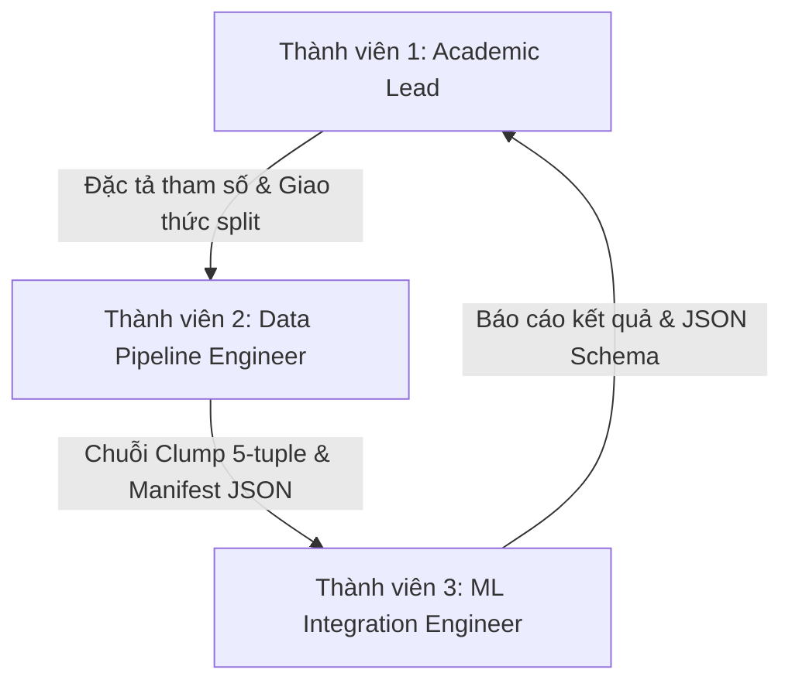

# Kế Hoạch Triển Khai Nhóm & Quy Trình Hợp Tác (Team Plan & Collaboration Protocol)

Tài liệu này định nghĩa cơ cấu tổ chức nhóm Capstone 3 thành viên, phân định trách nhiệm, giao diện tích hợp giữa các cấu phần, các cột mốc tuần tự, tiêu chuẩn hoàn thành công việc (Definition of Done), quy tắc bình duyệt mã nguồn (Pull Request review), và cơ chế kiểm chứng ngoại tuyến bằng bản demo không phụ thuộc thư viện ngoài.

---

## 1. Mô Hình Phân Công 3 Vai Trò (3-Role Team Assignment)

Dự án được tổ chức theo mô hình chuyên trách 3 vai trò nhằm đảm bảo tính toàn diện từ nền tảng lý thuyết học thuật, kỹ thuật xử lý dữ liệu mạng an toàn, đến tích hợp mô hình và kiểm thử hệ thống.



### 1.1. Thành viên 1: Trưởng nhóm Phương pháp & Tái hiện Học thuật (Academic Lead & Protocol Specialist)
* **Trách nhiệm chính:**
  * Phân tích chuyên sâu bài báo gốc MontazeriShatoori et al. (2020) và mã nguồn công khai `DoHLyzer` của nhóm tác giả UNB CIC.
  * Xác định và lập tài liệu hoá toàn bộ các thông số kỹ thuật bị khuyết thiếu trong bài báo (hyperparameters của mạng LSTM/CNN, thuật toán tối ưu hoá, learning rate, cơ chế padding/truncation chuỗi thời gian).
  * Xây dựng giao thức tái hiện khoa học nghiêm ngặt (`docs/replication_protocol.md`), phân định rõ ràng giữa:
    * `Paper báo cáo`: Số liệu và phương pháp được công bố trong bài báo gốc.
    * `Nhóm quyết định`: Các lựa chọn kỹ thuật do nhóm đề xuất để bổ khuyết các khoảng trống của bài báo.
    * `Rủi ro/giả định`: Các điểm giả định về môi trường, sự trôi dạt giao thức hoặc rủi ro rò rỉ dữ liệu.
  * Quản trị rủi ro học thuật, pháp lý và cấp phép dữ liệu (`docs/risk_register.md`).
* **Sản phẩm bàn giao (Deliverables):**
  * `docs/paper_analysis.md`: Bản phân tích đối chiếu toàn diện các bảng kết quả và cấu trúc 28 đặc trưng.
  * `docs/replication_protocol.md`: Giao thức tái hiện đối chiếu exact replication vs modern benchmark.
  * `docs/risk_register.md`: Bảng quản trị ma trận rủi ro và biện pháp giảm thiểu.

### 1.2. Thành viên 2: Kỹ sư Hạ tầng Dữ liệu & Xử lý Gói tin (Data & Feature Pipeline Engineer)
* **Trách nhiệm chính:**
  * Quản trị dữ liệu theo đúng chuẩn mực tại `docs/data_contract.md`, giám sát không để lọt PCAP hoặc PII vào repository.
  * Hiện thực hoá thuật toán gom cụm gói tin Packet Clumping theo quy tắc DoHLyzer (cùng chiều, khoảng cách liên tiếp $\le 1\text{ ms}$, xử lý monotonic timestamp và trường hợp payload rỗng).
  * Xây dựng module trích xuất `clumping.py` thuần Python standard library với kiểu dữ liệu rõ ràng (`NamedTuple` hoặc `dataclass`).
  * Viết bộ kiểm thử đơn vị tự động `tests/test_clumping.py` kiểm chứng toàn diện mọi trường hợp biên của quá trình gom cụm (thay đổi chiều gói, vượt ngưỡng thời gian 1 ms, luồng quá ngắn, dữ liệu sai mốc thời gian).
  * Chuẩn bị các tệp JSON manifest phục vụ kiểm toán dữ liệu và phân vùng train/test không chồng lấn session (`session-disjoint split`).
* **Sản phẩm bàn giao (Deliverables):**
  * `src/doh_reproduction/clumping.py`: Module trích xuất clump thuần thư viện chuẩn.
  * `tests/test_clumping.py`: Bộ kiểm thử đơn vị tự động đạt độ bao phủ đầy đủ các ca biên.
  * `data/README.md` & các tệp `data/manifests/*.manifest.json`: Hệ thống tài liệu và manifest kiểm soát dữ liệu.

### 1.3. Thành viên 3: Kỹ sư Mô hình & Kiểm thử Tích hợp (ML Integration & Verification Engineer)
* **Trách nhiệm chính:**
  * Hiện thực hoá kiến trúc phân loại phân cấp 2 tầng tuần tự:
    * **Tầng 1 (L1):** Phân biệt lưu lượng DoH vs Non-DoH với ngưỡng chuỗi $l=6$ clumps.
    * **Tầng 2 (L2):** Phân loại DoH thành Benign-DoH vs Malicious-DoH (DNS Tunnel) với ngưỡng chuỗi $l=3$ clumps.
  * Xây dựng module demo ngoại tuyến `src/doh_reproduction/demo.py` hoạt động độc lập không phụ thuộc thư viện ngoài (zero external dependencies), sử dụng bộ phân loại mẫu chuỗi xác định (deterministic sequence-prototype classifier) để kiểm chứng pipeline.
  * Đo đạc và xuất báo cáo JSON định dạng chuẩn gồm ma trận nhầm lẫn (Confusion Matrix), Precision, Recall, F1-score và độ trễ xử lý (Latency) cho cả hai tầng.
  * Cấu hình đóng gói dự án qua `pyproject.toml` tương thích Python 3.11+ tiêu chuẩn.
* **Sản phẩm bàn giao (Deliverables):**
  * `src/doh_reproduction/demo.py`: Kịch bản demo kiểm chứng pipeline 2 tầng ngoại tuyến.
  * `pyproject.toml`: Tệp cấu hình gói dự án chuẩn PEP 621.
  * `README.md`: Hướng dẫn vận hành nhanh và đặc tả lược đồ kết quả JSON.

---

## 2. Hợp Đồng Tích Hợp Giữa Các Vai Trò (Integration Contracts)

Để tránh hiện tượng xung đột hoặc lệch pha khi phát triển độc lập, các thành viên cam kết giao tiếp thông qua 3 hợp đồng tích hợp bất biến:

### Hợp đồng 1: Giao diện Chuỗi Clump (Data Pipeline -> ML Integration)
* Module `clumping.py` cung cấp hàm thuần túy (pure function) `clumping(packets: Sequence[Packet], timeout: float = CLUMP_TIMEOUT_SECONDS, first_interarrival: float = 0.0) -> list[Clump]` (với `CLUMP_TIMEOUT_SECONDS = 0.001` giây).
* Quy tắc gom cụm và khởi tạo clump mới:
  * Khởi tạo clump mới khi thay đổi chiều truyền thông (`direction`) hoặc khoảng cách thời gian giữa hai gói tin liên tiếp vượt quá ngưỡng `timeout` ($> 0.001\text{ s}$).
  * Bác bỏ các gói tin có kích thước payload âm (`length < 0`) hoặc nhãn thời gian không đơn điệu ($t[i] < t[i-1]$).
* Mỗi đối tượng `Clump` bắt buộc chứa 5 trường giá trị số học theo đúng thứ tự vector `to_vector()`:
  1. `size`: tổng kích thước payload/frame của tất cả các gói tin trong clump tính bằng byte $\ge 0$.
  2. `pkt_count`: tổng số lượng gói tin vật lý được gom trong clump $\ge 1$.
  3. `direction`: chiều truyền thông của luồng (`0`: Client->Server / forward, `1`: Server->Client / backward).
  4. `duration`: thời lượng tồn tại của clump tính bằng giây $\ge 0.0$ ($t_{\text{last}} - t_{\text{first}}$).
  5. `interarrival`: khoảng thời gian tính từ mốc kết thúc của clump trước đó đến mốc bắt đầu của clump hiện tại (`current_clump_start - previous_clump_end`). Riêng clump đầu tiên bắt buộc quy ước mặc định `first_interarrival = 0.0`.
* Đầu ra của bộ trích xuất clump phải mang tính tiền định (deterministic), không phụ thuộc trạng thái toàn cục.

### Hợp đồng 2: Quy tắc Luồng Phân cấp 2 Tầng (Academic Lead -> ML Integration)
* **Tầng 1 (L1):** Chỉ thu thập $l_1 = 6$ clumps đầu tiên của flow để đưa ra quyết định dự đoán. Nếu flow không đạt đủ 6 clumps, áp dụng quy tắc padding hoặc đánh dấu không đủ điều kiện phân loại sớm.
* **Tầng 2 (L2):** Chỉ những flow được L1 dự đoán là DoH mới được kích hoạt bộ phân loại L2 với $l_2 = 3$ clumps. Những flow bị L1 gán nhãn Non-DoH sẽ bị loại bỏ khỏi đường ống phân tích L2.
* Sai số tầng 1 (False Negatives hoặc False Positives) phải được tích lũy đầy đủ vào ma trận nhầm lẫn chung cuộc của toàn hệ thống phân cấp.

### Hợp đồng 3: Lược đồ Xuất Kết quả JSON (ML Integration -> Academic Lead & Docs)
* Kết quả thực thi demo bắt buộc xuất cấu trúc JSON có định dạng chuẩn mực, chứa cờ cảnh báo rõ ràng `disclaimer` xác nhận đây là synthetic demo, không phải kết quả thực nghiệm bài báo.
* Không được giả lập hay tạo sinh ngẫu nhiên các chỉ số vượt trội giả tạo để đánh lừa người đọc.

---

## 3. Lộ Trình Cột Mốc Triển Khai Tuần Tự (Ordered Milestones)

| Cột mốc | Tên cột mốc | Mục tiêu trọng tâm | Tiêu chí nghiệm thu (Acceptance Criteria) |
| :---: | :--- | :--- | :--- |
| **M1** | **Khung Hợp đồng & Harness Ngoại tuyến** | Thiết lập không gian làm việc `doh_tunnel_detection/`, hợp đồng dữ liệu, demo synthetic zero-dependency, bộ test clumping. | Lệnh `PYTHONPATH=src python3 -m doh_reproduction.demo` và `unittest` chạy thành công 100% trên Python 3.11+. Không cần pip install. |
| **M2** | **Phân tích Học thuật & Thẩm định Dữ liệu** | Hoàn tất phân tích chuyên sâu `NetworkData2.pdf`, lập hồ sơ tiếp cận dataset CIRA-CIC-DoHBrw-2020 và kiểm tra mã băm SHA-256. | Các tài liệu `paper_analysis.md`, `replication_protocol.md`, `risk_register.md` hoàn thành với đầy đủ bằng chứng đối chiếu. |
| **M3** | **Tái hiện Tầng 1 (L1: DoH vs Non-DoH)** | Triển khai phân loại Tầng 1 trên dữ liệu thực tế bằng 28 đặc trưng thống kê và chuỗi 6 clumps LSTM trên môi trường huấn luyện riêng. | Đo lường độ trễ phân loại (paper báo cáo L1 mất ~20.4s cho flow features và <1s cho 6-clump LSTM). Báo cáo ma trận nhầm lẫn L1. |
| **M4** | **Tái hiện Tầng 2 & Ghép nối Phân cấp (L2)** | Ghép nối Tầng 2 ($l=3$ clumps) với các flow DoH từ Tầng 1. Đánh giá phát hiện các công cụ tunnel: Iodine, dns2tcp, dnscat2. | Báo cáo ma trận nhầm lẫn tích luỹ 2 tầng; ghi nhận tỷ lệ rò lọt tunnel khi L1 phân loại nhầm DoH thành Non-DoH. |
| **M5** | **Đánh giá Chống Rò rỉ & Tổng kết Capstone** | Thực nghiệm kịch bản phân chia train/test theo `session-disjoint` để đánh giá overfit; tổng hợp báo cáo capstone hoàn chỉnh. | Báo cáo nêu bật sự khác biệt giữa phân chia 80/20 ngẫu nhiên của paper và phân chia session-disjoint thực tế; bảo vệ đồ án thành công. |

---

## 4. Tiêu Chuẩn Hoàn Thành (Definition of Done - DoD)

Một hạng mục công việc chỉ được xem là hoàn thành (Done) khi đáp ứng toàn bộ các tiêu chí nghiêm ngặt sau:

### 4.1. Tiêu chuẩn Mã nguồn & Kiểm thử (Code & Tests)
1. **Tuân thủ Chuẩn Python:** Mã nguồn tương thích hoàn toàn từ Python 3.11 đến 3.13 tiêu chuẩn; harness cốt lõi tuyệt đối không import thư viện thứ ba.
2. **Kiểm thử Tự động:** Mọi đoạn mã trích xuất và xử lý dữ liệu phải có bài kiểm thử đơn vị (`unittest`) tương ứng. Toàn bộ test suite chạy pass không có cảnh báo (`0 errors, 0 failures`).
3. **Tính Tiền định (Determinism):** Mọi thuật toán phân loại mẫu hoặc sinh dữ liệu synthetic phải sử dụng seed cố định để đảm bảo kết quả có thể lặp lại chính xác trên bất kỳ máy trạm nào.

### 4.2. Tiêu chuẩn Tài liệu & Tính Trung thực Học thuật (Academic Rigor & Non-claim)
1. **Gắn nhãn Tuyên bố Minh bạch:** Mọi nhận định kỹ thuật hoặc số liệu phải được gắn một trong ba nhãn xuất xứ:
   * `[Paper báo cáo]`
   * `[Nhóm quyết định]`
   * `[Rủi ro/giả định]`
2. **Tuyệt đối Không Mạo nhận:** Không bao giờ sử dụng kết quả của bộ phân loại synthetic proxy trong `demo.py` để công bố là độ chính xác tái hiện bài báo gốc.
3. **Đầy đủ Trích dẫn & Nguồn gốc:** Mọi tài liệu trích dẫn chính xác số trang, bảng biểu của `NetworkData2.pdf` và liên kết URL tới các kho tài nguyên chính thức.

### 4.3. Tiêu chuẩn An toàn Mạng & Quyền Riêng tư (Defensive Safety & Privacy)
1. **Sạch Kho Lưu trữ:** Lệnh `git status` không hiển thị bất kỳ tệp `.pcap`, tệp dữ liệu phái sinh lớn, khoá bí mật hay checkpoint nhị phân nào.
2. **Môi trường Phòng thủ:** Không có bất kỳ dòng lệnh nào khởi chạy tunnel mạng thật hoặc yêu cầu quyền hạn root/quản trị viên trên máy trạm.

---

## 5. Quy Tắc Bình Duyệt Mã Nguồn & Đóng Góp (Pull-Request & Review Rules)

Nhằm duy trì chất lượng mã nguồn và tính toàn vẹn của dự án, mọi đóng góp phải tuân thủ quy trình Pull Request (PR) sau:

### 5.1. Nguyên tắc "Two-Person Rule"
* Không một thành viên nào được phép tự ý merge mã nguồn của mình vào nhánh chính (`main`).
* Mọi PR bắt buộc phải được ít nhất **một thành viên khác** trong nhóm xem xét, chạy thử trên máy cá nhân và nhấn **Approve**.

### 5.2. Bảng Kiểm Tra Bắt Buộc trong Mỗi PR (Mandatory PR Checklist)
Trước khi yêu cầu review, tác giả PR phải tự kiểm tra và đánh dấu vào checklist:

```markdown
### PR Verification Checklist
- [ ] Không có file binary lớn, file PCAP (*.pcap, *.pcapng), tệp log hoặc model checkpoint (*.h5, *.pt) trong danh sách commit.
- [ ] Chạy kiểm thử thành công: `PYTHONPATH=src python3 -m unittest discover -s tests -v`.
- [ ] Chạy demo kiểm chứng pipeline thành công: `PYTHONPATH=src python3 -m doh_reproduction.demo`.
- [ ] Đầu ra JSON của demo hợp lệ về mặt schema, chứa đầy đủ warning/disclaimer và không bịa đặt số liệu.
- [ ] Mọi hàm mới hoặc thay đổi cấu trúc dữ liệu đều có docstring và type hints rõ ràng.
- [ ] Tài liệu liên quan (`data_contract.md`, `team_plan.md`, hoặc docs chuyên môn) đã được cập nhật đồng bộ.
```

### 5.3. Quy ước Đặt Tên Nhánh (Branching Convention)
* Nhánh tính năng: `feature/<role>-<short-description>` (ví dụ: `feature/data-clumping-parser`, `feature/ml-hierarchical-demo`).
* Nhánh sửa lỗi: `fix/<issue-name>` (ví dụ: `fix/monotonic-timestamp-check`).
* Nhánh tài liệu: `docs/<topic-name>` (ví dụ: `docs/risk-register-update`).

---

## 6. Quy Trình Vận Hành Demo Ngoại Tuyến (Offline Synthetic Demo Workflow)

Kịch bản demo được thiết kế nhằm mục đích **chứng minh quy trình làm việc (workflow proof)** một cách trực quan, minh bạch và an toàn tuyệt đối.

### 6.1. Luồng Dữ Liệu Demo Trong Bộ Nhớ
```text
1. Khởi tạo Vết gói tin Synthetic (Deterministic Packet Traces)
   - Phân chia kịch bản tách biệt: Non-DoH, Benign-DoH, Malicious-DoH (Tunnel)
   - Tách biệt train/test theo kịch bản (scenario-disjoint)
        │
        ▼
2. Trích xuất Cụm gói tin (Packet Clumping via clumping.py)
   - Nhóm gói tin cùng chiều có khoảng cách thời gian dt <= 1 ms
   - Tạo bộ 5-tuple: (size, pkt_count, direction, duration, interarrival)
        │
        ▼
3. Đóng gói Cửa sổ Chuỗi Thời gian (Sequence Windowing)
   - Tầng 1: Cửa sổ 6 clumps đầu tiên (l = 6)
   - Tầng 2: Cửa sổ 3 clumps đầu tiên (l = 3)
        │
        ▼
4. Phân loại Phân cấp 2 Tầng (Deterministic Sequence-Prototype Scoring)
   - Bộ phân loại nguyên mẫu tính toán khoảng cách đặc trưng chuỗi xác định
   - Tầng 1 dự đoán DoH vs Non-DoH
   - Chỉ các luồng được dự đoán là DoH mới đi tiếp vào Tầng 2
   - Tầng 2 phân loại Benign-DoH vs Malicious Tunnel
        │
        ▼
5. Tính toán Chỉ số Đánh giá & Xuất Payload JSON
   - Ma trận nhầm lẫn L1 & L2 (True Positives, False Positives, True Negatives, False Negatives)
   - Precision, Recall, F1-score và độ trễ ước tính (Latency ms)
   - Xuất cảnh báo bắt buộc: KHÔNG PHẢI KẾT QUẢ TÁI HIỆN PAPER HỌC THUẬT
```

### 6.2. Cơ Chế Bảo Vệ Tính Trung Thực (Integrity Safeguards)
* **Không mạo danh LSTM:** Mô hình trong script demo được ghi rõ tên là `DeterministicSequencePrototypeClassifier` (hoặc proxy classifier tương đương), tuyệt đối không gán nhãn sai lệch là mạng Long Short-Term Memory (LSTM) khi chưa qua huấn luyện học sâu thực tế.
* **Không yêu cầu môi trường mạng:** Toàn bộ quá trình sinh vết gói tin và phân loại diễn ra trong bộ nhớ RAM, không mở socket, không lắng nghe cổng và không phát sinh lưu lượng mạng ra ngoài máy trạm.
